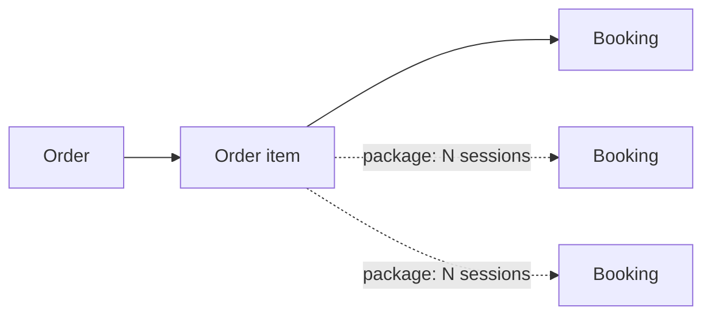
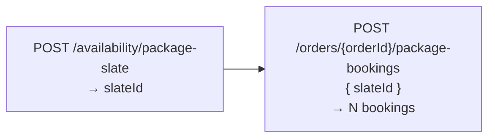

Before you call a single endpoint, it helps to hold one rule in your head:
**nothing is booked without an order item to draw down.** Every booking in
MarketBox — single or package — consumes credits from an order item that
already exists. This page explains that model so the guides that follow
(single bookings, package bookings, availability, addresses) make sense as
variations on one idea, not four unrelated flows.

## Order-first

The **order** is the purchase record. The **order item** is the thing that
gets consumed. A **booking** is what consumes it.

You always create the order (and its item) before you create a booking. The
booking's service line then carries `orderId` and `orderItemId`, tying the
schedule entry back to the commerce record it drew down.



For a single session, one order item funds exactly one booking. For a
package, one order item funds many bookings — see below.

<Note>
An order can exist without ever being paid, and a booking can be created
against it while it's still unpaid. See [Credits and payment](#credits-and-payment).
</Note>

## Single vs package

MarketBox has two shapes of order item, and the difference between them is
the difference between the two booking flows you'll build.

**Single booking** — one order item per service line. You create an order
with a `SINGLE_SESSION` item, then create one booking whose service line
references that item's `orderId` and `orderItemId`. One item, one booking,
one draw-down.

**Package booking** — one `PACKAGE` order item, drawn down across N sessions.
This is the part worth internalizing: **the order item *is* the package
instance**, and its `quantityRemaining` field *is* the live credit ledger.
You don't track "how many sessions has this client used" yourself — you read
it off the order item.

```json
// POST /orders response (abridged) — the PACKAGE item after creation
{
  "items": [
    {
      "orderItemId": "oi_01k...",
      "skuType": "PACKAGE",
      "quantity": 8,
      "quantityRemaining": 8,
      "expiresAt": "2026-10-06T00:00:00.000Z"
    }
  ]
}
```

Book against a package with a single call to
`POST /orders/{orderId}/package-bookings`. The server creates every session's
booking atomically, stamps each one with the same `packageOrderItemId`, and
decrements `quantityRemaining` by however many sessions it books. When
`quantityRemaining` hits zero, the package is spent — there's nothing left
to draw down.

<Tip>
You create the `PACKAGE` order item the same way you create any order item:
`POST /orders { clientId, currency, items: [{ skuType: "PACKAGE", packageId }] }`.
The server derives the service, offering, session count, price, and expiry
from the package definition — you only supply the `packageId`.
</Tip>

## Slates

Booking eight sessions one at a time — checking availability, picking a
slot, repeating — doesn't scale, and it's easy to end up with sessions that
don't actually fit the client's recurring schedule. MarketBox solves this
with **slates**.

A slate is a complete, N-session plan for a package **from one supplier**,
computed in one call from a recurrence rule (`rrule`) and a location. Ask
`POST /availability/search` for one-off single slots; ask
`POST /availability/package-slate` for a *whole plan* — the server picks the
best single supplier that can fill every session, resolves each session's
time and location up front, and hands you back a `slateId`.

The two-step shape is always the same:



1. **Build the slate.** `POST /availability/package-slate` with the
   `packageId`, a location, and an `rrule` (e.g. every Mon/Wed/Fri, 8
   sessions) returns a `primarySlate` with a `slateId` and the resolved
   `slots[]`.
2. **Book it by id.** `POST /orders/{orderId}/package-bookings` with just
   `{ orderItemId, slateId }` — the server re-resolves every session's
   supplier, time, and location itself (including filling in the location
   for travel-zone bookings) and creates all N bookings in one atomic
   transaction.

You never have to copy times or locations out of the slate response by
hand — sending the `slateId` back is enough. (An older, more manual path
exists where you transcribe each resolved slot into a `sessions[]` array
yourself, but book-by-`slateId` is the one to reach for by default.)

<Warning>
Provide **exactly one** of `sessions`, `slateId`, or `slotIds` when booking
a package — never a mix. And once you have a slate, book it (or the subset
you want via `slotIds`) as-is; don't re-derive the location yourself, since
the slate already resolved it correctly.
</Warning>

Slates aren't held forever — a chosen slot can go stale between building the
slate and booking it, in which case you'll get a `409` telling you so with
fresh alternatives. The [availability and slates guide](/guides/availability-and-slates)
covers building slates, holds, and stale-slot recovery in full.

### Reserving vs. booking

A plain booking — `POST /bookings`, or a package booked directly by
`slateId`/`sessions`/`slotIds` — is created immediately. There's no
in-between "reserved" state and no reservation window to manage.

A **timed hold** is a different, narrower thing: it only exists inside the
package-slate flow. You build a slate, hold its slots (`POST
/suggestions/holds`) to reserve them while the customer pays, then convert
the hold to real bookings on payment success. Nothing outside that flow can
be held — see [Availability and slates](/guides/availability-and-slates#path-b-holds-convert)
for the full lifecycle.

## Credits and payment

Here's the detail that trips up most integrations: **credits exist at order
creation, not at payment.** Creating an order (with its item) immediately
gives you something bookable, and creating a booking against that order item
succeeds even while the order is still `DRAFT` and unpaid.

Payment — via Stripe or a manual transaction — settles the order. It moves
money and updates the order's status and paid amount. It does **not** gate
whether a booking can be created. Don't build a flow that blocks booking
until Stripe confirms; the two are independent.

<Note>
This also means you can build the entire scheduling half of your
integration — orders, order items, single and package bookings — without
touching payment at all, then layer Stripe on top separately. See
[Accept payments with Stripe](/guides/accept-payments-with-stripe) for how
charging an order works once you're ready for it.
</Note>

## Where to go next

<CardGroup cols={2}>
<Card title="Create a single booking" icon="calendar-check" href="/guides/create-a-single-booking">
  Walk through the single-session flow end to end: order, order item, booking.
</Card>
<Card title="Create a package booking" icon="layer-group" href="/guides/create-a-package-booking">
  Build a package order item and draw it down across multiple sessions.
</Card>
<Card title="Availability and slates" icon="calendar-days" href="/guides/availability-and-slates">
  Search single slots, build package slates, and handle stale-slot retries.
</Card>
<Card title="Booking addresses" icon="location-dot" href="/guides/booking-addresses">
  When a structured address is required and how it's threaded through bookings and slates.
</Card>
</CardGroup>
