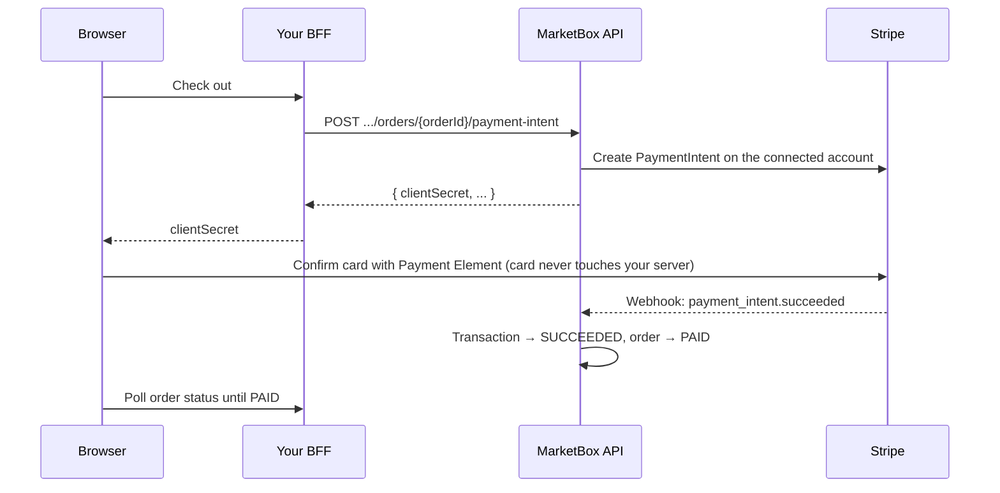

This guide walks you through taking real payments in a custom booking flow. A
client books, you charge their card with Stripe, and the order is marked
**paid** — all without card details ever touching your server.

It builds on [Build a booking flow](/guides/booking-flow-auth): you already have
an API key, the [backend-for-frontend (BFF)](/guides/booking-flow-auth#the-bff-pattern)
pattern, and can create orders. Here you add the payment step.

## How payments work

MarketBox charges cards through **Stripe Connect** using **direct charges**: the
charge is created on the **business's own connected Stripe account**, and the
business is the merchant of record. Card data goes **straight from the
client's browser to Stripe** using Stripe's Payment Element, so your servers
never see or store it (this keeps you at the lightest PCI compliance level,
SAQ-A).

The money flow has one rule worth memorizing: **an order becomes `PAID` only
when Stripe confirms the charge through a webhook** — never from the browser's
confirmation response. You mark nothing as paid yourself; you wait for MarketBox
to.



## Prerequisites

<Steps>
<Step title="The business connects its Stripe account">
Before you can charge, a project admin connects the business's Stripe account on
the project's [**Payments** settings page](https://mb-core.vercel.app/dashboard/project/{projectId}/settings/payments/)
in the MarketBox dashboard. This is a one-time action per business, done through
Stripe's hosted onboarding.

<Warning>
Connecting is not enough on its own — Stripe must have **charges enabled** on the
account. With Standard Connect the business completes Stripe's own onboarding
(business profile, and identity details such as a tax ID) until Stripe activates
charges. Until then, creating a PaymentIntent returns `409 CONFLICT` (the
project has no Stripe account connected, or isn't yet cleared to take
charges). The business owner completes this in their own Stripe dashboard;
the platform cannot fill it in for them.
</Warning>
</Step>

<Step title="Get your Stripe browser values">
Direct charges need two **public** values in the browser:

| Value | What it is | Where it comes from |
| --- | --- | --- |
| Publishable key | MarketBox's **platform** Stripe publishable key (`pk_…`) | A per-environment [Connection detail](/guides/booking-flow-auth#values-you-receive) — the same for every integration |
| Connected account id | The business's Stripe account (`acct_…`) | The **Payments** page of the dashboard |

<Note>
A publishable key is meant to be public — it can only do safe client-side work
(confirming a PaymentIntent that already has a `client_secret`). For direct
charges you use MarketBox's **one** platform publishable key and target the
individual business with its **account id** (`stripeAccount`), not a per-business
key.
</Note>
</Step>

<Step title="Install Stripe.js">
```bash
npm install @stripe/stripe-js @stripe/react-stripe-js
```
</Step>
</Steps>

## Configure the keys

Add the two public values to your browser config, and keep your API key
server-only as always:

```bash
# Browser-safe (both are public)
NEXT_PUBLIC_STRIPE_PUBLISHABLE_KEY=pk_test_...      # MarketBox platform key (Connection details)
NEXT_PUBLIC_STRIPE_ACCOUNT_ID=acct_...              # the business's connected account

# Server-only (unchanged from the booking-flow guide)
MARKETBOX_API_KEY=...
MARKETBOX_API_URL=...
MARKETBOX_PROJECT_ID=prj_...
```

Initialize Stripe.js once, binding the platform key to the connected account:

```ts
// lib/stripe.ts
import { loadStripe, type Stripe } from '@stripe/stripe-js';

let promise: Promise<Stripe | null> | null = null;

// Direct charges: the PLATFORM publishable key + the business's connected
// account. Both values are public and safe to ship to the browser.
export function getStripe(): Promise<Stripe | null> {
  if (!promise) {
    promise = loadStripe(process.env.NEXT_PUBLIC_STRIPE_PUBLISHABLE_KEY!, {
      stripeAccount: process.env.NEXT_PUBLIC_STRIPE_ACCOUNT_ID!,
    });
  }
  return promise;
}
```

## Step 1 — Start from an order with a balance

You charge an **order**, not individual items. Create the order (or reach an
existing one) so it has a positive balance to collect. See
[Orders](/resources/orders) for the full lifecycle; the amount you'll charge is
`order.total − order.amountPaid`.

<Note>
The order must be in `DRAFT` or `PENDING` status, and the balance must be
greater than zero. Amounts are **integer minor units** (cents): `4500` means
`$45.00`.
</Note>

## Step 2 — Create the PaymentIntent from your BFF

Add a BFF route that asks MarketBox to create the PaymentIntent. MarketBox
creates it on the connected account, records a pending transaction, and returns
the **client secret** your browser needs. The API key stays on the server.

```ts
// app/api/bff/payment-intent/route.ts
import { NextResponse } from 'next/server';

export async function POST(request: Request) {
  const { orderId } = await request.json();

  const res = await fetch(
    `${process.env.MARKETBOX_API_URL}/v1/projects/${process.env.MARKETBOX_PROJECT_ID}/orders/${orderId}/payment-intent`,
    {
      method: 'POST',
      headers: {
        'x-api-key': process.env.MARKETBOX_API_KEY!, // server-only
        'content-type': 'application/json',
      },
    },
  );

  const body = await res.json().catch(() => ({}));
  return NextResponse.json(body, { status: res.status });
}
```

A successful response carries the client secret:

```json
{
  "data": {
    "clientSecret": "pi_3Tp..._secret_Pkp...",
    "paymentIntentId": "pi_3Tp...",
    "transactionId": "txn_01k...",
    "amount": { "amount": 4500, "currency": "CAD" }
  }
}
```

<Tip>
Calling this endpoint again for the same order **reuses** the existing pending
PaymentIntent instead of creating a second one, so it's safe to retry. Still,
request it **once** per checkout on the client (see the ref guard below) — a
double render or double click can otherwise create a duplicate intent.
</Tip>

## Step 3 — Collect the card with the Payment Element

Fetch the client secret, mount Stripe's **Payment Element**, and confirm. The
card is entered inside Stripe's iframe and sent directly to Stripe.

```tsx
// components/PayForm.tsx
'use client';

import { useEffect, useRef, useState } from 'react';
import {
  Elements,
  PaymentElement,
  useElements,
  useStripe,
} from '@stripe/react-stripe-js';
import { getStripe } from '@/lib/stripe';

export function PayForm({ orderId, onPaid }: { orderId: string; onPaid: () => void }) {
  const [clientSecret, setClientSecret] = useState<string | null>(null);
  const started = useRef(false); // request the intent exactly once

  useEffect(() => {
    if (started.current) return;
    started.current = true;
    fetch('/api/bff/payment-intent', {
      method: 'POST',
      headers: { 'content-type': 'application/json' },
      body: JSON.stringify({ orderId }),
    })
      .then((r) => r.json())
      .then((r) => setClientSecret(r.data.clientSecret));
  }, [orderId]);

  if (!clientSecret) return <p>Preparing secure payment…</p>;

  return (
    <Elements stripe={getStripe()} options={{ clientSecret }}>
      <CardStep orderId={orderId} onPaid={onPaid} />
    </Elements>
  );
}

function CardStep({ orderId, onPaid }: { orderId: string; onPaid: () => void }) {
  const stripe = useStripe();
  const elements = useElements();
  const [busy, setBusy] = useState(false);
  const [message, setMessage] = useState<string | null>(null);

  async function pay() {
    if (!stripe || !elements) return;
    setBusy(true);
    setMessage(null);

    // Confirm in-page. `redirect: 'if_required'` keeps single-page flows inline
    // and only redirects when a payment method genuinely needs it (e.g. 3-D Secure).
    const { error, paymentIntent } = await stripe.confirmPayment({
      elements,
      redirect: 'if_required',
    });

    if (error) {
      setMessage(error.message ?? 'Payment failed');
      setBusy(false);
      return;
    }
    if (paymentIntent?.status !== 'succeeded') {
      setMessage(`Payment status: ${paymentIntent?.status}`);
      setBusy(false);
      return;
    }

    // Stripe confirmed the card. The order is marked PAID by a MarketBox webhook,
    // not by this response — poll until it flips (see Step 4).
    setMessage('Payment confirmed — finalizing your order…');
    const paid = await pollUntilPaid(orderId);
    setBusy(false);
    if (paid) onPaid();
    else setMessage('Payment succeeded; your order will finalize momentarily.');
  }

  return (
    <>
      <PaymentElement />
      <button onClick={pay} disabled={busy || !stripe}>
        {busy ? 'Processing…' : 'Pay now'}
      </button>
      {message && <p>{message}</p>}
    </>
  );
}
```

## Step 4 — Wait for the webhook to mark the order paid

The browser's "succeeded" result means the card cleared — but the **order** is
only `PAID` once Stripe's webhook reaches MarketBox and the ledger is finalized.
That usually takes a couple of seconds. Poll the order until it flips.

Add a BFF route to read the order:

```ts
// app/api/bff/orders/[orderId]/route.ts
import { NextResponse } from 'next/server';

export async function GET(
  _req: Request,
  ctx: { params: Promise<{ orderId: string }> },
) {
  const { orderId } = await ctx.params;
  const res = await fetch(
    `${process.env.MARKETBOX_API_URL}/v1/projects/${process.env.MARKETBOX_PROJECT_ID}/orders/${orderId}`,
    { headers: { 'x-api-key': process.env.MARKETBOX_API_KEY! } },
  );
  const body = await res.json().catch(() => ({}));
  return NextResponse.json(body, { status: res.status });
}
```

And poll it from the client:

```ts
async function pollUntilPaid(orderId: string): Promise<boolean> {
  for (let i = 0; i < 15; i++) {
    const res = await fetch(`/api/bff/orders/${orderId}`);
    const { data } = await res.json();
    if (data?.status === 'PAID') return true;
    await new Promise((r) => setTimeout(r, 1000));
  }
  return false; // still finalizing — the webhook will complete it shortly
}
```

<Warning>
Never treat the browser's confirmation result as proof of payment. It can be
lost, delayed, or spoofed. The **order status** (driven by the webhook) is the
source of truth for whether money moved.
</Warning>

## Test it

Use Stripe **test mode** and the standard test card:

<Steps>
<Step title="Pay with a test card">
Card **`4242 4242 4242 4242`**, any future expiry, any CVC and postal code.
</Step>
<Step title="Confirm the order is paid">
Poll the order (Step 4) — it should flip to `PAID` within a few seconds, with
`amountPaid` equal to `total`.
</Step>
<Step title="Inspect the ledger (optional)">
`GET /v1/projects/{projectId}/transactions?orderId={orderId}` shows a
`PAYMENT` / `STRIPE` / `SUCCEEDED` transaction for the charge.
</Step>
</Steps>

<Note>
**Minimum charge.** Stripe rejects amounts below roughly **$0.50 USD
equivalent**. Mind currency conversion — for example `$0.50 CAD` is under the
USD floor and will fail. There is no way to charge a `$0` balance; skip the
payment step when nothing is owed.
</Note>

### Packages work the same way

A package order (buying a block of session credits) charges exactly like a
single order — the amount is the package's price, and the same Payment Element
flow applies. After payment, the order's ledger shows the `PAYMENT` plus a
`CREDIT_REDEMPTION` transaction for each session booked against the package, so
you can see both the money in and the credits drawn down.

## Show the card a client last paid with

Once a card payment settles, MarketBox records a small snapshot of the card on
the client's profile. It's there for one purpose: so you can show a returning
client something like *"You last paid with Visa ending 4242"* without building
your own card store.

Read it from the client profile. Onboarding is idempotent, so calling it again
for an already-onboarded client simply returns their current profile with a
`200`:

```ts
// Requires BOTH an API key and the signed-in client's JWT.
const res = await fetch(
  `${MARKETBOX_API_URL}/v1/projects/${MARKETBOX_PROJECT_ID}/clients/me`,
  {
    method: 'POST',
    headers: {
      'x-api-key': MARKETBOX_API_KEY,          // server-only
      authorization: `Bearer ${userToken}`,     // the signed-in end user
    },
  },
);

const { data: client } = await res.json();
```

The two fields to look at:

```json
{
  "data": {
    "clientId": "cli_dolphin_web",
    "lastPaymentMethodId": "pm_1SxYz...",
    "lastPayment": {
      "type": "CARD",
      "brand": "visa",
      "last4": "4242",
      "expMonth": 12,
      "expYear": 2027,
      "paidAt": "2026-07-14T15:04:11.000Z"
    }
  }
}
```

| Field | Notes |
| --- | --- |
| `lastPaymentMethodId` | Stripe's payment-method id (`pm_…`) for the card most recently charged. |
| `lastPayment.brand` | Card brand as Stripe reports it — `visa`, `mastercard`, `amex`, … |
| `lastPayment.last4` | The last four digits. The only part of the card number MarketBox stores. |
| `lastPayment.expMonth` / `expYear` | Expiry. May be absent. |
| `lastPayment.paidAt` | When Stripe created the charge (not when MarketBox recorded it). |

Both fields are **optional**. They're absent for a client who has never paid by
card — a brand-new client, or one who has only ever paid by cash or been comped.
Always guard before rendering.

<Warning>
**This is for display, not for deciding what to charge.** `lastPayment` is a
derived, best-effort snapshot, and Stripe remains the source of truth for what
cards a client actually has. It is written from Stripe's `charge.succeeded`
webhook, so it can lag a payment by a second or two, and in rare cases (a
webhook that never lands and is recovered by reconciliation instead) it may not
update at all until the client's next payment. Don't gate a checkout on it,
don't reconcile against it, and don't infer from it that a card is still valid
or chargeable.
</Warning>

<Note>
There is no public endpoint to charge a saved card. Every payment in a custom
booking flow goes through the Payment Element (Steps 2–3) — which is what keeps
you at SAQ-A. `lastPayment` tells you what the client *used* last; it does not
let you re-use it.
</Note>

## Reference

### Endpoints used in this guide

| Endpoint | Method | Auth | Description |
| --- | --- | --- | --- |
| `/v1/projects/{projectId}/orders/{orderId}/payment-intent` | `POST` | `x-api-key` | Create (or reuse) the PaymentIntent for an order. Returns `clientSecret`. |
| `/v1/projects/{projectId}/orders/{orderId}` | `GET` | `x-api-key` | Read the order; poll `status` for `PAID`. |
| `/v1/projects/{projectId}/transactions?orderId=` | `GET` | `x-api-key` | The order's transaction ledger. |
| `/v1/projects/{projectId}/clients/me` | `POST` | `x-api-key` + user JWT | Idempotent. Returns the client profile, including `lastPayment` (see [above](#show-the-card-a-client-last-paid-with)). |

### Configuration

| Value | Env var | Browser? |
| --- | --- | --- |
| MarketBox platform publishable key | `NEXT_PUBLIC_STRIPE_PUBLISHABLE_KEY` | Yes (public) |
| Business's connected account id | `NEXT_PUBLIC_STRIPE_ACCOUNT_ID` | Yes (public) |
| API key | `MARKETBOX_API_KEY` | **No** (server-only) |
| API base URL | `MARKETBOX_API_URL` | **No** (BFF-only) |

### Errors and edge cases

| Scenario | Status / signal | Resolution |
| --- | --- | --- |
| Business's Stripe isn't charge-ready | `409` on `payment-intent` | Finish Stripe onboarding until charges are enabled (see Prerequisites). |
| Order has no balance, or wrong status | `400` on `payment-intent` | Charge only a `DRAFT`/`PENDING` order with `total − amountPaid > 0`. |
| Amount below Stripe's minimum | Payment fails | Ensure the charge is ≥ ~$0.50 USD equivalent; skip payment for `$0`. |
| Card confirmed but order not `PAID` yet | Transient | Keep polling — the webhook finalizes it within seconds. |
| Duplicate PaymentIntent | Extra pending intent | Request the intent once per checkout (ref guard). Only the confirmed intent charges; unconfirmed ones expire. |

### Security checklist

<Check>`MARKETBOX_API_KEY` is server-only — never `NEXT_PUBLIC_`.</Check>
<Check>Card data is collected only by Stripe's Payment Element — never posted to your server.</Check>
<Check>Order `status` (not the browser result) is what you treat as proof of payment.</Check>
<Check>The publishable key and account id are the only Stripe values in the browser — both are public and safe.</Check>
<Check>`lastPayment` is treated as display-only — never as proof a card is valid or chargeable.</Check>
