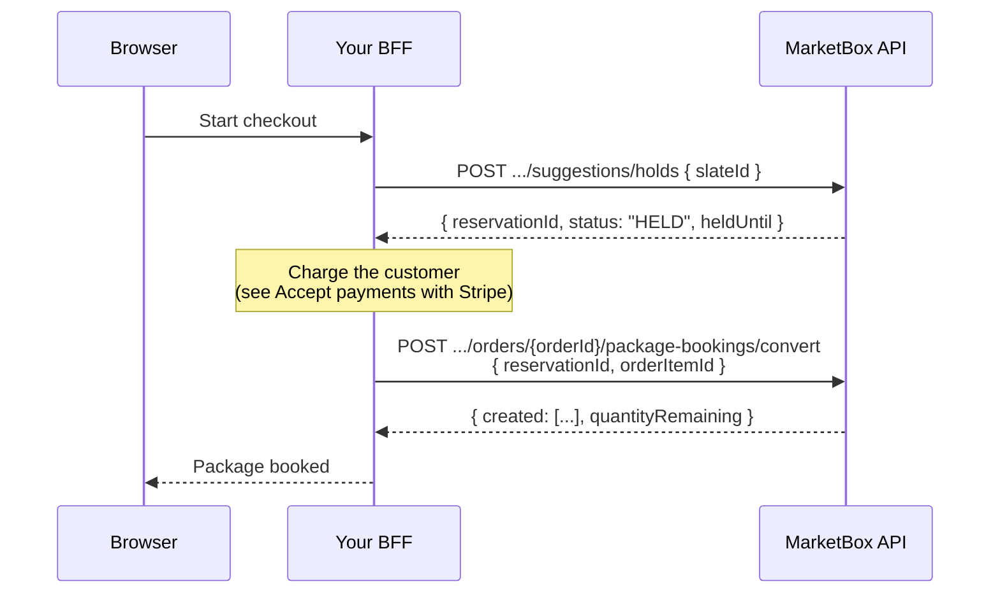

This is the deep-dive companion to
[Create a package booking with a slate](/guides/create-a-package-booking). That
guide covers the primary flow — build a slate, create an order, book it by
`slateId` — end to end. This page goes underneath it: what the three
availability endpoints are for, exactly what a slate response contains, the
cadence rules that shape it, and the two advanced booking paths that exist
alongside book-by-`slateId`.

It builds on [The booking engine model](/concepts/booking-engine-model) —
read the [Slates](/concepts/booking-engine-model#slates) section first if you
haven't.

## The availability engine

Three endpoints sit under `/v1/projects/{projectId}/availability`, all
authenticated with `x-api-key`. They're layers of the same clustering engine,
from lowest to highest level:

| Endpoint | Use it when |
| --- | --- |
| `POST .../availability/time-slots` | You already hold the scheduling state (suppliers, their bookings, their availability) and want to run the engine directly, passing everything in the body. |
| `POST .../availability/search` | You have a service + offering + location and want the API to resolve suppliers from project data and return suggested/open slots — one-off, single-session slots. |
| `POST .../availability/package-slate` | You want a **complete N-session plan** for a package from one supplier, computed from a recurrence rule (`rrule`). This is the endpoint the rest of this guide covers. |

<Note>
`/search` and `/time-slots` are documented in full in the
[Availability resource reference](/resources/availability) — request fields,
the recurring-search variant, and response envelopes. This guide focuses on
`/package-slate`, since it's the one with package-specific anatomy and the
two advanced booking paths below.
</Note>

## Anatomy of a slate

`POST /availability/package-slate` takes a `packageId` (the session count,
service, and offering are derived from it), a location, a `timezone`, and a
cadence (`lookAheadStartDate` + `rrule`). The response is a
`PackageSlateResponse`:

```json
{
  "status": "OK",
  "reason": null,
  "suggestionRequestId": "sugreq_01kx16ej7pe4r9da74adf6m4h0",
  "resolvableUntil": "2026-07-10T00:00:00.000Z",
  "primarySlate": {
    "slateId": "slate_01kx16ejsqffc9rbgdcc591w2p",
    "supplierId": "sup_01kv60qgnef2kt3pvqgwmkbzfr",
    "completeness": "COMPLETE",
    "sessionsRequested": 8,
    "sessionsFilled": 8,
    "startTimeConsistencyPercent": 100,
    "totalTravelTimeMins": 0,
    "slots": []
  },
  "alternates": [],
  "partial": null
}
```

(`slots[]` abridged to `[]` here — see [Create a package booking](/guides/create-a-package-booking)
for a fully populated example, and the field tables below for its shape.)

| Field | Meaning |
| --- | --- |
| `status` | `OK`, `NO_COMPLETE_SLATE`, or `NO_AVAILABILITY` — see below. |
| `reason` | Human-readable explanation when `status` isn't `OK`. `null` on success. |
| `suggestionRequestId` | Audit id for this request. Present only when `persist` is `true` (the default). |
| `resolvableUntil` | Slates and slots stay resolvable (holdable/bookable by id) for **24 hours** from the request; after that they're stale. |
| `primarySlate` | The best **COMPLETE** single-supplier slate — book this by `slateId`. `null` if none satisfies the project's supplier policy. |
| `alternates` | Runner-up suppliers' slates. Empty unless the project's `suggestionConfig.supplierPolicy` permits considering multiple suppliers. |
| `partial` | The best **PARTIAL** slate (fills fewer than the requested sessions). `null` unless the project has `suggestionConfig.allowPartialPackages` enabled. |

### Status values

| `status` | Meaning |
| --- | --- |
| `OK` | A `COMPLETE` primary slate was found — every requested session filled by one supplier. |
| `NO_COMPLETE_SLATE` | No complete single-supplier slate exists under the project's supplier policy. `alternates` may still be populated (multi-supplier policy) and `partial` may still be usable (if `allowPartialPackages` is on) — check both before treating this as a dead end. |
| `NO_AVAILABILITY` | No availability at all for the request window — no supplier, complete or partial. |

<Warning>
When neither `primarySlate` nor `partial` comes back (nothing bookable at
all), the endpoint returns **`422`** with the `code` set to `status`
(`NO_COMPLETE_SLATE` or `NO_AVAILABILITY`) — not a `200` with an empty body.
</Warning>

### Slate and slot fields

Each slate (`primarySlate`, entries in `alternates`, and `partial`) has the
same shape:

| Field | Meaning |
| --- | --- |
| `slateId` | Book the whole plan with this — pass it as `slateId` to `POST .../package-bookings`. |
| `supplierId` | The single supplier this slate is built from. |
| `completeness` | `COMPLETE` or `PARTIAL`. |
| `sessionsRequested` / `sessionsFilled` | How many of the package's sessions this plan could fill, out of how many were requested. |
| `startTimeConsistencyPercent` | How consistent the session start times are (0–100). |
| `totalTravelTimeMins` | Summed travel time across the plan's sessions. |
| `slots[]` | The resolved sessions — see below. |

Each entry in `slots[]`:

| Field | Meaning |
| --- | --- |
| `slotId` | Id of one session. Pass a subset of these as `slotIds` to cherry-pick instead of booking the whole slate. |
| `sessionIndex` | **1-based** position within the slate. |
| `supplierId`, `serviceId`, `offeringId` | Resolved identifiers for this session. |
| `bookingStartUtc`, `bookingEndUtc`, `bookingTz` | The resolved time. |
| `locationType`, `locationId`, `latitude`, `longitude`, `address` | The resolved location — for `TRAVEL_ZONE` slates the engine fills `locationId` (the supplier's travel-zone id) and stamps the request's `address` onto every slot. |
| `travelTimeMins` | Travel time to this session. |
| `capacity` | Session capacity. |
| `reservationStatus` | `FREE`, `HELD`, `CONVERTED`, or `RELEASED` — see "Path B+: holds → convert" below. |

<Tip>
**Off-by-one trap.** `sessionIndex` is **1-based** here in the slate's
`slots[]`, but **0-based** in the `created[]` array returned by
`POST .../package-bookings` (and `.../convert`). Don't compare them directly
without adjusting — see
[Create a package booking](/guides/create-a-package-booking).
</Tip>

## Cadence rules: `rrule` and `lookAheadStartDate`

`package-slate` derives its whole session plan from two request-shape
guarded fields. Both are enforced at validation time (a `400` before the
engine ever runs), not just documented convention.

### `rrule` needs a bounded, positive `COUNT`

```
✅ FREQ=WEEKLY;BYDAY=MO,TU,WE,TH,FR;COUNT=8
❌ FREQ=WEEKLY;BYDAY=MO,TU,WE,TH,FR
```

An unbounded `rrule` almost never returns anything bookable — the engine
needs a specific number of occurrences to try to fill, not an open-ended
pattern. Omitting `COUNT` (or giving `COUNT=0`) fails validation:

```json
{
  "code": "VALIDATION_ERROR",
  "message": "rrule: 'rrule' must include a bounded COUNT (e.g. 'FREQ=WEEKLY;BYDAY=MO;COUNT=8')",
  "statusCode": 400,
  "requestId": "req_2hY3..."
}
```

<Note>
The `message` is prefixed with the offending field name (`rrule: …`) — the
validation layer prepends the field path to every schema error.
</Note>

### `lookAheadStartDate` needs a numeric offset, not `Z`

```
✅ 2026-07-09T00:00:00-04:00
❌ 2026-07-09T00:00:00Z
```

The recurring builder derives the request's UTC offset from the **last six
characters** of `lookAheadStartDate`, so a `Z` suffix produces a garbage
offset and silently wrong results — the API rejects it outright instead:

```json
{
  "code": "VALIDATION_ERROR",
  "message": "lookAheadStartDate: 'lookAheadStartDate' must carry a numeric timezone offset (e.g. '2026-07-01T00:00:00-04:00'), not a 'Z' suffix",
  "statusCode": 400,
  "requestId": "req_2hY3..."
}
```

### The 31-day look-ahead ceiling

You don't have to compute the look-ahead window yourself — by default it's
**derived from your cadence and the package's `creditCount`**, so the engine
searches exactly as far ahead as it needs to fit every session. That
derived window is capped at **31 days**.

If the cadence is too sparse to fit all of a package's sessions within 31
days, `package-slate` fails fast with a `422` **before running the engine at
all**, naming the exact window it would have needed:

For example, a package with `creditCount: 8` requested with a
Monday-only cadence (`FREQ=WEEKLY;BYDAY=MO;COUNT=8`) needs about 7 weeks
(50 days including the inclusive end boundary) to fit all 8 sessions — over
the cap. Because nothing is bookable, this comes back as a `422` in the
standard [error envelope](/concepts/errors) (the `reason` becomes `message`
and the `status` becomes `code`), **not** a `200` with a slate body:

```json
{
  "code": "NO_COMPLETE_SLATE",
  "message": "package cadence requires 50-day availability window for 8 sessions, which exceeds the 31-day maximum",
  "statusCode": 422,
  "requestId": "req_2hY3..."
}
```

Compare that to the working example from
[Create a package booking](/guides/create-a-package-booking): the same
8-session package with `FREQ=WEEKLY;BYDAY=MO,TU,WE,TH,FR;COUNT=8` fits 8
sessions into under two weeks (five eligible weekdays per week), well inside
the cap.

<Tip>
If you need a window wider than the derived default, pass `lookAheadDays` or
`endDate` explicitly — they override the derivation. They're still subject
to the same engine behavior (a wider window doesn't bypass the 31-day cap;
it's the engine's absolute ceiling).
</Tip>

## Path A: book explicit sessions (transcribe)

The primary path — passing `{ slateId }` to `POST .../package-bookings` — is
what [Create a package booking](/guides/create-a-package-booking) walks
through, and it's the one to reach for by default: the server re-resolves
every session itself.

Path A is the fallback for when you need to alter or filter individual
sessions before booking (for example, dropping one session from an
8-session slate, or swapping in a client-chosen alternate time you resolved
separately). Instead of `slateId`, you build a `sessions[]` array yourself
by copying each slot from the slate response:

```ts
// Map each resolved slot to a `sessions[]` entry — VERBATIM.
function transcribeSlot(slot: PackageSlot) {
  return {
    supplierId: slot.supplierId,
    bookingStartUtc: slot.bookingStartUtc,
    bookingEndUtc: slot.bookingEndUtc,
    bookingTz: slot.bookingTz,
    locationType: slot.locationType,
    locationId: slot.locationId,
    latitude: slot.latitude,
    longitude: slot.longitude,
    address: slot.address,
    services: [{ serviceId: slot.serviceId, offeringId: slot.offeringId }],
  };
}

const sessions = primarySlate.slots.map(transcribeSlot);

await fetch(`${API_BASE_URL}/v1/projects/${PROJECT_ID}/orders/${orderId}/package-bookings`, {
  method: 'POST',
  headers: { 'x-api-key': MARKETBOX_API_KEY, 'content-type': 'application/json' },
  body: JSON.stringify({
    orderItemId,
    idempotencyKey: crypto.randomUUID(),
    atomicity: 'all_or_nothing',
    sessions,
  }),
});
```

<Warning>
**Copy each slot verbatim — do not re-derive locations.** A `TRAVEL_ZONE`
slot's `locationId` is the supplier's *resolved travel zone*, computed by
the slate engine specifically for that supplier and location. Recomputing
it yourself (e.g. re-resolving from raw `lat`/`lng`) can silently select the
wrong zone and mis-place the booking by a meaningful distance. Take the slot
fields as-is; only omit or reorder whole sessions, never recompute their
contents.
</Warning>

`slotId`, `sessionIndex`, `travelTimeMins`, `capacity`, and
`reservationStatus` are **not** part of a session entry — they're slate
metadata, not booking input. Only the fields listed above go into
`sessions[]`.

Provide **exactly one** of `sessions`, `slateId`, or `slotIds` on
`POST .../package-bookings` — sending more than one (or none) is a `400
VALIDATION_ERROR`.

## Path B+: holds → convert

Both `slateId` and Path A book immediately. If you need to **hold sessions
while the customer pays** — a timed checkout — use the hold lifecycle
instead. This is the pattern for pay-then-book flows where you don't want
to release the slate's sessions to another customer while checkout is in
progress.

<Note>
**Holds, reschedule, and convert are package-only.** All three operate
exclusively on slots persisted by `POST /availability/package-slate` — that's
the only endpoint that produces anything holdable. `/availability/search` and
`/availability/time-slots` return suggestions, not persisted slots, so
nothing they return can be held, rescheduled, or converted.

Single sessions have no reservation window at all: `POST /bookings` books
immediately (see [Create a single booking](/guides/create-a-single-booking)).
If you need to reserve a slot before the customer pays, you must go through a
package slate — even for what is conceptually a single session.
</Note>



<Steps>
<Step title="Hold the slate">
`POST /suggestions/holds` with `{ slateId }` (or `{ slotIds }` to hold a
subset) flips every targeted slot `FREE → HELD` atomically — either all of
them hold, or none do.

```ts
const res = await fetch(`${API_BASE_URL}/v1/projects/${PROJECT_ID}/suggestions/holds`, {
  method: 'POST',
  headers: { 'x-api-key': MARKETBOX_API_KEY, 'content-type': 'application/json' },
  body: JSON.stringify({ slateId: primarySlate.slateId }),
  // holdDurationMins defaults to the project's suggestionConfig.holdDurationMins (5 if unset)
});
```

```json
{
  "reservationId": "resv_01kx17a...",
  "status": "HELD",
  "heldUntil": "2026-07-08T14:35:00.000Z",
  "slateId": "slate_01kx16ejsqffc9rbgdcc591w2p",
  "slotIds": ["slot_01kx16ejsrfs7tf3edy19wdsf8", "..."]
}
```

Provide **exactly one** of `slateId` or `slotIds` — same rule as booking.

<Note>
Holds expire **lazily**: nothing actively sweeps them, but a slot past its
`heldUntil` is treated as free again the next time it's read or targeted.
</Note>
</Step>

<Step title="Take payment">
Charge the customer with whatever flow you're already using — see
[Accept payments with Stripe](/guides/accept-payments-with-stripe). The hold
keeps the sessions reserved while this happens; nobody else can hold or book
them until `heldUntil` passes or you release explicitly.
</Step>

<Step title="Convert the hold to bookings">
On payment success, `POST /orders/{orderId}/package-bookings/convert` with
`{ reservationId, orderItemId }`. It re-validates the hold, books every
session through the same path as direct package-bookings, and flips the
slots to `CONVERTED`.

```ts
const res = await fetch(
  `${API_BASE_URL}/v1/projects/${PROJECT_ID}/orders/${orderId}/package-bookings/convert`,
  {
    method: 'POST',
    headers: { 'x-api-key': MARKETBOX_API_KEY, 'content-type': 'application/json' },
    body: JSON.stringify({ reservationId, orderItemId }),
  },
);
```

Response shape is identical to direct `package-bookings` — `created[]`,
`failed[]`, `quantityRemaining` — and is **not** wrapped in `{ data }`.

<Tip>
**`convert` is idempotent — safe for a payment webhook to call.** It's keyed
on a deterministic `convert:<reservationId>` idempotency key internally, so
if a webhook fires twice (or you retry after a timeout), the second call
returns the same stored result instead of double-booking. Call it directly
from your payment-succeeded webhook handler, not just the browser's
response.
</Tip>
</Step>

<Step title="Or release, to abandon">
If the customer bails before paying, release the hold explicitly rather
than waiting for it to lapse:

```ts
await fetch(
  `${API_BASE_URL}/v1/projects/${PROJECT_ID}/suggestions/holds/${reservationId}/release`,
  { method: 'POST', headers: { 'x-api-key': MARKETBOX_API_KEY } },
);
```

```json
{ "reservationId": "resv_01kx17a...", "status": "RELEASED" }
```

<Note>
Release always returns **`200`**, never `404` or `409` — it's deliberately a
no-op on an already-released, already-converted, or unknown reservation
(`status` comes back `RELEASED`, `CONVERTED`, or `NOT_FOUND` respectively).
Safe to call blindly on cleanup/abandon paths without checking hold state
first.
</Note>
</Step>
</Steps>

### Handling hold and convert conflicts

Both `hold` and `convert` can return `409` with the shared stale-suggestion
envelope — `{ code, message, freshSuggestions }` — where `freshSuggestions`
is a freshly regenerated `package-slate` response you can rebuild from:

- **Holding** a slot someone else already holds returns `code:
  "SLOT_ALREADY_HELD"`.
- **Converting** a hold that's missing, not `HELD`, held by a different
  session, or expired all collapse to the same `code:
  "SLOT_NO_LONGER_BOOKABLE"` — `message` carries the specific reason
  (reservation not found, not held, forbidden, or expired), but the `code`
  is uniform so client branching stays simple. Rebuild from
  `freshSuggestions` and start over (new hold, new payment) rather than
  retrying `convert` on the same `reservationId`.

## Reference

### Endpoints used in this guide

| Endpoint | Method | Auth | Description |
| --- | --- | --- | --- |
| `/v1/projects/{projectId}/availability/search` | `POST` | `x-api-key` | Single-session slot search. Full reference: [Availability](/resources/availability). |
| `/v1/projects/{projectId}/availability/time-slots` | `POST` | `x-api-key` | Direct engine invocation. Full reference: [Availability](/resources/availability). |
| `/v1/projects/{projectId}/availability/package-slate` | `POST` | `x-api-key` | Build an N-session slate for a package from one supplier. `422` when nothing is bookable. |
| `/v1/projects/{projectId}/orders/{orderId}/package-bookings` | `POST` | `x-api-key` | Book via `sessions` (Path A), `slateId`, or `slotIds` — exactly one. |
| `/v1/projects/{projectId}/suggestions/holds` | `POST` | `x-api-key` | Hold a slate or cherry-picked slots. Returns `reservationId` + `heldUntil`. |
| `/v1/projects/{projectId}/suggestions/holds/{reservationId}/release` | `POST` | `x-api-key` | Release a hold. Idempotent — always `200`. |
| `/v1/projects/{projectId}/orders/{orderId}/package-bookings/convert` | `POST` | `x-api-key` | Convert a held reservation to confirmed bookings. Idempotent — safe for webhooks. |

### Configuration

| Value | Env var | Browser? |
| --- | --- | --- |
| API key | `MARKETBOX_API_KEY` | **No** (server-only) |
| API base URL | `API_BASE_URL` | **No** (BFF-only) |
| Project id | `PROJECT_ID` | **No** (BFF-only) |

### Errors and edge cases

| Scenario | `code` | Status | Resolution |
| --- | --- | --- | --- |
| `rrule` has no bounded `COUNT` | `VALIDATION_ERROR` | `400` | Add a positive `COUNT`, e.g. `FREQ=WEEKLY;BYDAY=MO;COUNT=8`. |
| `lookAheadStartDate` has a `Z` suffix instead of a numeric offset | `VALIDATION_ERROR` | `400` | Use a numeric `±HH:MM` offset, e.g. `-04:00`. |
| Cadence needs more than 31 days to fit the package's `creditCount` sessions | `NO_COMPLETE_SLATE` | `422` | `reason` names the exact window required. Use a denser cadence (more days per week), or fewer sessions per call. |
| No availability at all for the requested window/location | `NO_AVAILABILITY` | `422` | Try a different location, timezone, or `lookAheadStartDate`. |
| No complete single-supplier slate under the project's supplier policy | `NO_COMPLETE_SLATE` | `422` | Check `alternates`/`partial` in the response first — they may still be usable. Otherwise widen the window or location. |
| Provided more than one (or none) of `sessions` / `slateId` / `slotIds` on booking or holding | `VALIDATION_ERROR` | `400` | Provide exactly one. |
| A targeted slot is already held by another checkout (holds only) | `SLOT_ALREADY_HELD` | `409` | Rebuild from `freshSuggestions` and hold a different slot/slate. |
| The referenced slate/slot doesn't exist or has no slots (**holds only**) | `SLATE_NOT_FOUND` / `SLOT_NOT_FOUND` | `409` | The slate id was mistyped, or is from a different project. Rebuild the slate. |
| The slot is past its 24-hour resolvable window (**holds only**) | `SUGGESTION_EXPIRED` | `409` | Rebuild the slate — slates aren't resolvable indefinitely. |
| Converting a reservation that's missing, not held, held by someone else, or expired | `SLOT_NO_LONGER_BOOKABLE` | `409` | `message` names the specific cause. Don't retry the same `reservationId` — start a new hold. |
| Chosen slot went stale between building a slate and booking it directly (`slateId`/`slotIds`, no hold) | `SLOT_NO_LONGER_BOOKABLE` | `409` | Same as above — covered in depth in [Create a package booking](/guides/create-a-package-booking#reference). |
| More than 20 sessions with `atomicity: "all_or_nothing"` (applies to direct booking and `convert` alike) | `PACKAGE_SLATE_TOO_LARGE_FOR_ATOMIC` | `422` | Use `atomicity: "best_effort"` (requires `suggestionConfig.allowPartialPackages`), or book/hold a smaller slate. |
| `best_effort` requested but the project hasn't enabled it | `BEST_EFFORT_NOT_ENABLED` | `422` | Stay with `all_or_nothing` (≤20 sessions), or ask the project to enable `suggestionConfig.allowPartialPackages`. |

<Warning>
**The granular `409` codes above (`SLATE_NOT_FOUND`, `SLOT_NOT_FOUND`,
`SUGGESTION_EXPIRED`, `SLOT_ALREADY_HELD`) are returned verbatim only by
`POST /suggestions/holds`.** At booking time — `POST .../package-bookings`
by `slateId`/`slotIds`, and `POST .../package-bookings/convert` — every one
of these same stale conditions is collapsed to a single
`code: "SLOT_NO_LONGER_BOOKABLE"` (the `message` still names the specific
cause). Branch on the distinct codes only when you're calling the holds
endpoint; for direct booking and convert, branch on
`SLOT_NO_LONGER_BOOKABLE` alone.
</Warning>

See [Errors](/concepts/errors) for the full envelope and code list, and
[Create a package booking](/guides/create-a-package-booking#reference) for
the errors specific to the order/order-item side of booking (expired
packages, insufficient quantity, and so on) — `convert` shares that same
booking path and can return the same set.
