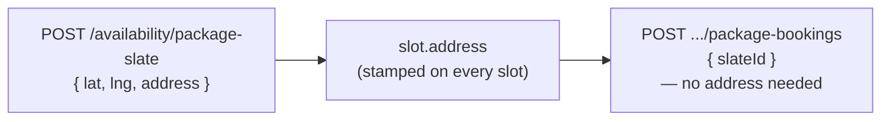

Some bookings need more than a `latitude`/`longitude` pair — they need a real,
structured street address a supplier can navigate to. This guide covers the
`address` object: its shape, exactly when it's required, and how it flows
through slates so you usually only have to supply it once.

It builds on [The booking engine model](/concepts/booking-engine-model). If
you haven't yet, read [Create a single booking](/guides/create-a-single-booking)
or [Create a package booking](/guides/create-a-package-booking) first — this
page assumes you're already creating bookings or slates and just need the
address piece.

## The address object

`address` is a structured object, not a free-text string — every field below
is validated independently so a supplier's app can render it, geocode it, or
hand it to a maps SDK without re-parsing anything.

| Field | Required | Example |
| --- | --- | --- |
| `addressOneLine` | Yes | `"100 Queen St W, Toronto, ON M5H 2N2, Canada"` |
| `streetNumber` | Yes | `"100"` |
| `streetName` | Yes | `"Queen St W"` |
| `city` | Yes | `"Toronto"` |
| `state` | Yes | `"ON"` |
| `country` | Yes | `"CA"` (ISO 3166-1 **alpha-2**) |
| `zipCode` | Yes | `"M5H 2N2"` |
| `unitNumber` | No | `"4B"` |

<Note>
`zipCode` accepts any format — it's a plain string, not validated against a
country-specific pattern. `country` is the odd one out: it's the only field
checked against a format (ISO-2), everything else is just "non-empty string."
</Note>

## Where it's required

`address` is only required where a booking's location is a **travel zone** —
a supplier traveling to the client, resolved from `latitude`/`longitude`
rather than a stored `Location` record. It's rejected as unnecessary nowhere,
but it's *validated as mandatory* in exactly four places:

1. **`POST /bookings`** with `locationType: "TRAVEL_ZONE"`.
2. **A package session** with `locationType: "TRAVEL_ZONE"` — whether that
   session arrives via the explicit `sessions[]` array on
   `POST /orders/{orderId}/package-bookings`, or is resolved for you inside a
   slate.
3. **The lat/lng branch of `POST /availability/package-slate`** — i.e. when
   you pass `lat` + `lng` instead of a stored `locationId`.
4. **`POST /holds`**, on any `intervals[]` entry with
   `locationType: "TRAVEL_ZONE"`. A hold mirrors the booking contract exactly,
   because [convert](/guides/hold-slots-for-checkout) rebuilds the booking from
   the hold alone — so an in-home session's address must be on the hold, not
   supplied later. (The `slateId` / `slotIds` forms of `POST /holds` need no
   address: the slate already stamped one onto every slot.)

`VIRTUAL` and `PHYSICAL` bookings never take an `address` at all — `VIRTUAL`
has no location fields, and `PHYSICAL` resolves everything from the stored
`Location` record (see the location-rules table in
[Create a single booking](/guides/create-a-single-booking#reference)).

<Warning>
Omitting `address` on any of the three cases above fails validation with a
`400` before the request does anything — there's no fallback that derives an
address from `lat`/`lng` for you. Reverse-geocoding is your integration's
responsibility (e.g. via a maps provider), not MarketBox's.
</Warning>

## How it threads through slates

This is the detail worth understanding before you assume you need to resend
`address` at every step of a package flow — you don't.

`address` is captured **once**, at slate-build time, on the lat/lng branch of
`POST /availability/package-slate`. The engine then **stamps that same
address onto every persisted slot** in the slate (`slots[].address`), whether
the slot's session is 1 of 8 or 8 of 8. When you later book with
`{ orderItemId, slateId }`, the server re-resolves each session from its
persisted slot — address included — so the TRAVEL_ZONE address rule on
`POST /orders/{orderId}/package-bookings` is satisfied automatically. You
never pass `address` a second time on the booking call itself.



The one place this doesn't apply automatically is the **transcribe** path
(Path A in [Availability and slates](/guides/availability-and-slates#path-a-book-explicit-sessions-transcribe)):
if you build your own `sessions[]` array instead of sending `slateId`, you
must copy `address` off each slot **verbatim**, the same as every other
location field — the server has no persisted slate to fall back on when
you're supplying sessions explicitly.

## Example: single booking

A `TRAVEL_ZONE` booking created directly with `POST /bookings` — the
`address` sits alongside `latitude`/`longitude` on the request body:

```json
{
  "clientId": "cli_dolphin_web",
  "supplierId": "sup_01kv60qgnef2kt3pvqgwmkbzfr",
  "bookingStartUtc": "2026-07-09T13:30:00.000Z",
  "bookingEndUtc": "2026-07-09T14:00:00.000Z",
  "bookingTz": "America/Toronto",
  "locationType": "TRAVEL_ZONE",
  "locationId": "stz_01kv60qgs4e4nbjhzradnqtj0h",
  "latitude": 43.6532,
  "longitude": -79.3832,
  "address": {
    "addressOneLine": "100 Queen St W, Toronto, ON M5H 2N2, Canada",
    "streetNumber": "100",
    "streetName": "Queen St W",
    "city": "Toronto",
    "state": "ON",
    "country": "CA",
    "zipCode": "M5H 2N2"
  },
  "capacity": 1,
  "services": [
    {
      "serviceId": "srv_01kv60qg12e82acr78edfnjhvv",
      "offeringId": "off_01kv60qge5eh59ap0gw0pqrrys",
      "businessModelType": "SINGLE_BOOKING",
      "quantity": 1,
      "orderId": "ord_01kx16ek2jf4r9da74adf6m4h0",
      "orderItemId": "oi_01kx16ek2kf2fsc9x7b2n1dfc9"
    }
  ]
}
```

See [Create a single booking](/guides/create-a-single-booking) for the full
three-call flow this body belongs to.

## Example: package slate

A slate built on the lat/lng (travel-zone) branch — `address` is a sibling of
`lat`/`lng`, not nested inside a location object:

```json
{
  "packageId": "pkg_01kv7n10k0fnptwk81wkm59vj7",
  "lat": 43.6532,
  "lng": -79.3832,
  "address": {
    "addressOneLine": "100 Queen St W, Toronto, ON M5H 2N2, Canada",
    "streetNumber": "100",
    "streetName": "Queen St W",
    "city": "Toronto",
    "state": "ON",
    "country": "CA",
    "zipCode": "M5H 2N2"
  },
  "timezone": "America/Toronto",
  "lookAheadStartDate": "2026-07-09T00:00:00-04:00",
  "rrule": "FREQ=WEEKLY;BYDAY=MO,TU,WE,TH,FR;COUNT=8"
}
```

Every one of the 8 resolved `slots[]` in the response carries this same
`address`. Book the slate with `{ orderItemId, slateId }` — no `address` field
on that call at all. See
[Create a package booking](/guides/create-a-package-booking) for the full
flow this body belongs to.

## Reference

### Where address is required

| Endpoint | When required |
| --- | --- |
| `POST /v1/projects/{projectId}/bookings` | `locationType: "TRAVEL_ZONE"` |
| `POST /v1/projects/{projectId}/orders/{orderId}/package-bookings` | Any explicit session (`sessions[]`) with `locationType: "TRAVEL_ZONE"` |
| `POST /v1/projects/{projectId}/availability/package-slate` | The lat/lng branch (`lat` + `lng`, no `locationId`) |
| `POST /v1/projects/{projectId}/holds` | Any `intervals[]` entry with `locationType: "TRAVEL_ZONE"` (not needed on the `slateId` / `slotIds` forms) |

Not required — and not accepted as a substitute for anything — on `VIRTUAL`
or `PHYSICAL` bookings or holds, or on the `locationId` branch of
`package-slate`.

### Errors and edge cases

| Scenario | Status | Resolution |
| --- | --- | --- |
| `address` missing on a `TRAVEL_ZONE` booking or session | `400` `VALIDATION_ERROR` | Supply the full structured object — every field except `unitNumber` is mandatory. |
| `address` missing on the lat/lng branch of `package-slate` | `400` `VALIDATION_ERROR` (`path: ["address"]`) | Supply `address` alongside `lat`/`lng`, or switch to a stored `locationId` if you have one. |
| `address` missing on a `TRAVEL_ZONE` interval of `POST /holds` | `400` `VALIDATION_ERROR` (`path: ["address"]`) | The hold is what convert rebuilds the booking from — send `address` (plus `latitude`/`longitude` and the `stz_` `locationId`) on the interval. See [Hold slots during checkout](/guides/hold-slots-for-checkout#troubleshooting). |
| A required field (e.g. `city`, `zipCode`) is missing or empty | `400` `VALIDATION_ERROR` | All fields but `unitNumber` must be non-empty strings — there's no partial-address fallback. |
| Booking by `slateId` still fails with a missing-address error | Shouldn't happen | The slate stamps `address` onto every slot at build time; if you're hitting this, confirm you're not building `sessions[]` by hand without copying `slot.address`. |

See [Errors](/concepts/errors) for the full envelope and code list.
