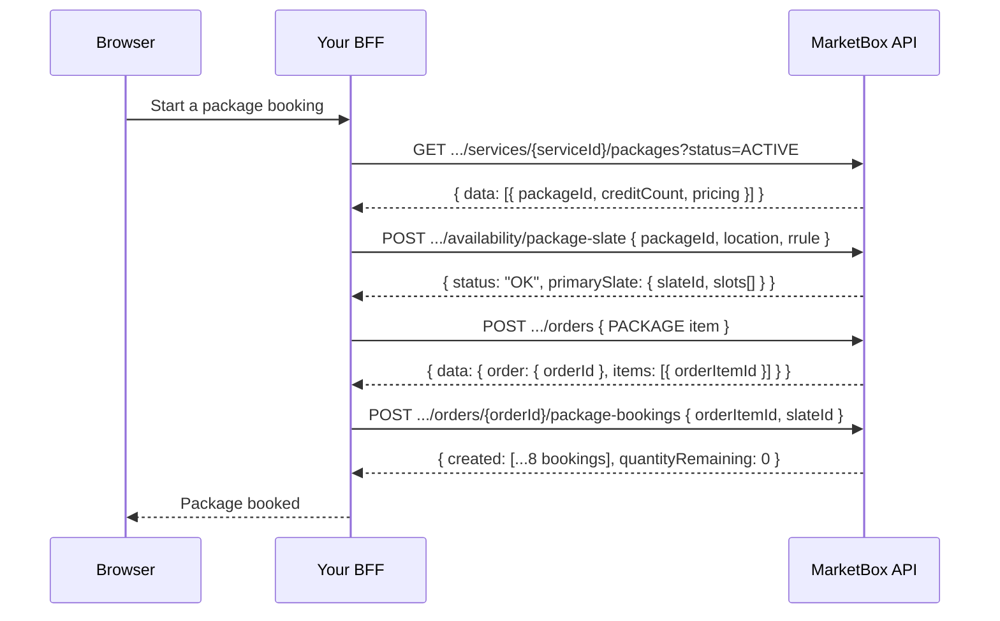

This guide walks through the flow for booking a **package** — a block of
session credits redeemed across N recurring sessions (e.g. "8 swim lessons,
Mon/Wed/Fri"). Instead of finding and booking each session one at a time, you
build one **slate** — a complete, server-resolved N-session plan — and book
the whole thing with a single call.

It builds on [The booking engine model](/concepts/booking-engine-model) —
read that first if you haven't, especially the [Slates](/concepts/booking-engine-model#slates)
section. This guide also assumes the [BFF pattern](/guides/booking-flow-auth#the-bff-pattern)
and an API key already set up.

<Note>
Every request in this guide is authenticated with the `x-api-key` header,
attached server-side by your BFF — never in the browser.
</Note>

<Note>
**Prerequisite: the service needs an active `PACKAGE` business
model.** Package creation (`POST /services/{serviceId}/offerings/{offeringId}/packages`)
fails with `400` if the parent service doesn't have one enabled. Business
models are set at the **service** level, not per-offering, so enabling it
makes packages creatable across every offering on that service.

Every booking created from a package — including via holds → convert — is
stamped `businessModelType: "PACKAGE"` with `packageOrderItemId`
set, never `SINGLE_BOOKING`. Keep that in mind for reporting/analytics that
segment bookings by business model.
</Note>

## How it works

A package booking is four calls, always in this order:

1. **Find the package.** `GET /services/{serviceId}/packages?status=ACTIVE`
   lists every sellable bundle on the service, across all of its offerings —
   the call a storefront makes before the client has picked an option. It
   gives you the `packageId` every later step needs.
2. **Build the slate.** `POST /availability/package-slate` with the
   `packageId`, a location, and an `rrule` (recurrence pattern) returns a
   `primarySlate` — the best single supplier's plan that fills every
   session — with a `slateId`.
3. **Create the order.** `POST /orders` with one `PACKAGE` item is what makes
   the package purchasable — it's the order item every session will draw
   down. The server derives the service, offering, session count, and price
   from the package.
4. **Book the slate.** `POST /orders/{orderId}/package-bookings` with just
   `{ orderItemId, slateId }` creates all N bookings atomically. You never
   copy times or locations out of the slate response by hand — the server
   re-resolves every session itself.



<Note>
**Payment is not required.** Just like single bookings, credits exist the
moment the order is created, not when it's paid. The order stays `DRAFT` and
all N sessions still book successfully — don't gate booking on Stripe. Layer
payment on afterward with [Accept payments with Stripe](/guides/accept-payments-with-stripe).
</Note>

<Steps>
<Step title="Find the package">
A **package** is a sellable bundle — a name, a `creditCount`, and `pricing`.
List every one on a service with
`GET /services/{serviceId}/packages?status=ACTIVE`. This is the discovery
call: it spans **all of the service's offerings**, so you can make it before
the client has chosen an option, and each package carries its `offeringId`
so you can join it against the offerings list you already hold.

```ts
// app/api/bff/packages/route.ts
import { NextResponse } from 'next/server';

export async function GET(request: Request) {
  const serviceId = new URL(request.url).searchParams.get('serviceId')!;

  const res = await fetch(
    `${process.env.MARKETBOX_API_URL}/v1/projects/${process.env.MARKETBOX_PROJECT_ID}/services/${serviceId}/packages?status=ACTIVE`,
    {
      headers: {
        'x-api-key': process.env.MARKETBOX_API_KEY!, // server-only
      },
    },
  );

  const body = await res.json().catch(() => ({}));
  return NextResponse.json(body, { status: res.status });
}
```

The standard list envelope, one entry per bundle (abridged to two of the
service's packages):

```json
{
  "data": [
    {
      "packageId": "pkg_01kvr4cgb3esg8hxx32kwhre7g",
      "serviceId": "srv_01kv60qg12e82acr78edfnjhvv",
      "offeringId": "off_01kv60qge5eh59ap0gw0pqrrys",
      "name": { "en": "8-Session Pack" },
      "creditCount": 8,
      "capacity": 1,
      "pricingModel": "FLAT",
      "pricing": [
        {
          "ruleId": "r_9f2c1b04",
          "scope": "DEFAULT",
          "price": { "amount": 45000, "currency": "USD" }
        },
        {
          "ruleId": "r_210b02de",
          "scope": "COUNTRY",
          "country": "CA",
          "price": { "amount": 45000, "currency": "CAD" }
        }
      ],
      "status": "ACTIVE"
    },
    {
      "packageId": "pkg_01kvc5m1t8h2y4nq7wzb3jde6k",
      "offeringId": "off_01kv60qge5eh59ap0gw0pqrrys",
      "name": { "en": "5-Session Pack" },
      "creditCount": 5,
      "status": "ACTIVE"
    }
  ],
  "nextCursor": null
}
```

<Note>
**Don't list business models and render them as packages.** The
`PACKAGE` **business model** is only a flag on the service meaning
"this service *can* be sold as packages." It is **not** a sellable bundle,
and it carries **no `creditCount` and no `pricing`** — those fields live on
the packages this endpoint returns. Reading the business-models list and
rendering each row as a package gives you one package-shaped object with
null session count and null price, and hides the real bundles entirely.
The packages are here; the business model just permits them.
</Note>

<Note>
**A service with no packages is a `200` with `data: []`, not an error** —
hide the tab, don't branch on a status code. An **unknown** `serviceId` is a
`404`, so a typo can never masquerade as "this service sells no packages."
</Note>

Take the `packageId` of the bundle the client picks into the next step.
</Step>

<Step title="Build the slate">
Call `POST /availability/package-slate` with the package, a location, a
timezone, and a bounded recurrence rule. The example below uses the
travel-zone branch (`lat` + `lng` + `address`) — you can pass a stored
`locationId` instead if you have one.

```ts
// app/api/bff/package-slate/route.ts
import { NextResponse } from 'next/server';

export async function POST(request: Request) {
  const { packageId } = await request.json();

  const res = await fetch(
    `${process.env.MARKETBOX_API_URL}/v1/projects/${process.env.MARKETBOX_PROJECT_ID}/availability/package-slate`,
    {
      method: 'POST',
      headers: {
        'x-api-key': process.env.MARKETBOX_API_KEY!, // server-only
        'content-type': 'application/json',
      },
      body: JSON.stringify({
        packageId,
        lat: 43.6532,
        lng: -79.3832,
        address: {
          addressOneLine: '100 Queen St W, Toronto, ON M5H 2N2, Canada',
          streetNumber: '100',
          streetName: 'Queen St W',
          city: 'Toronto',
          state: 'ON',
          country: 'CA',
          zipCode: 'M5H 2N2',
        },
        timezone: 'America/Toronto',
        lookAheadStartDate: '2026-07-09T00:00:00-04:00',
        rrule: 'FREQ=WEEKLY;BYDAY=MO,TU,WE,TH,FR;COUNT=8',
      }),
    },
  );

  const body = await res.json().catch(() => ({}));
  return NextResponse.json(body, { status: res.status });
}
```

<Warning>
`lookAheadStartDate` must carry a **numeric `±HH:MM` offset** (e.g.
`-04:00`) — a `Z` suffix is rejected. That offset must also match the
timezone's **actual UTC offset for that date, including daylight saving** —
Toronto is `-04:00` in summer (EDT) but `-05:00` in winter (EST), so a
copy-pasted `-04:00` will be wrong off-season. `rrule` must include a
**bounded, positive `COUNT`** (e.g. `COUNT=8`) — an unbounded rrule almost
always returns nothing bookable. Both are enforced request-shape validation,
not just convention.
</Warning>

A successful response carries `status: "OK"` and the `primarySlate` — the
`sessionsFilled` out of `sessionsRequested`, plus the resolved `slots[]`
(shown here abridged to the first slot of 8):

```json
{
  "status": "OK",
  "reason": null,
  "suggestionRequestId": "sugreq_01kx16ej7pe4r9da74adf6m4h0",
  "resolvableUntil": "2026-07-10T00:00:00.000Z",
  "primarySlate": {
    "slateId": "slate_01kx16ejsqffc9rbgdcc591w2p",
    "supplierId": "sup_01kv60qgnef2kt3pvqgwmkbzfr",
    "completeness": "COMPLETE",
    "sessionsRequested": 8,
    "sessionsFilled": 8,
    "startTimeConsistencyPercent": 100,
    "totalTravelTimeMins": 0,
    "slots": [
      {
        "slotId": "slot_01kx16ejsrfs7tf3edy19wdsf8",
        "sessionIndex": 1,
        "supplierId": "sup_01kv60qgnef2kt3pvqgwmkbzfr",
        "serviceId": "srv_01kv60qg12e82acr78edfnjhvv",
        "offeringId": "off_01kv60qge5eh59ap0gw0pqrrys",
        "bookingStartUtc": "2026-07-09T13:30:00.000Z",
        "bookingEndUtc": "2026-07-09T14:00:00.000Z",
        "bookingTz": "America/Toronto",
        "locationType": "TRAVEL_ZONE",
        "locationId": "stz_01kv60qgs4e4nbjhzradnqtj0h",
        "latitude": 43.6532,
        "longitude": -79.3832,
        "reservationStatus": "FREE"
      }
    ]
  },
  "alternates": [],
  "partial": null
}
```

<Note>
If nothing bookable can be found, the response is `422` with `code:
"NO_COMPLETE_SLATE"` (a complete single-supplier plan doesn't exist under
the project's supplier policy) or `code: "NO_AVAILABILITY"` (no availability
at all in the window). See the Reference section below.
</Note>

You only need `primarySlate.slateId` for the next steps — hold onto it.
</Step>

<Step title="Create the order">
Create an order with one `PACKAGE` item naming the package. You don't send
the service, offering, session count, or price — the server derives all of
them from the package definition. You **do** need to tell the order where
this booking happens, or it prices off the package's `DEFAULT` rule instead
of the regional one. This guide's flow never holds the slate (holding is
covered separately, below), so the region source it actually has on hand at
this point is the same `address` (or `locationId`) passed to
`POST /availability/package-slate` in Step 2 — pass that:

```ts
// app/api/bff/orders/route.ts
import { NextResponse } from 'next/server';

export async function POST(request: Request) {
  const { clientId, packageId } = await request.json();

  const res = await fetch(
    `${process.env.MARKETBOX_API_URL}/v1/projects/${process.env.MARKETBOX_PROJECT_ID}/orders`,
    {
      method: 'POST',
      headers: {
        'x-api-key': process.env.MARKETBOX_API_KEY!, // server-only
        'content-type': 'application/json',
      },
      body: JSON.stringify({
        clientId,
        currency: 'CAD',
        // Same address passed to package-slate in Step 2 — this is what
        // selects the CAD price. Booking a stored Location instead of a
        // travel zone? Pass that Location's locationId here instead.
        address: {
          addressOneLine: '100 Queen St W, Toronto, ON M5H 2N2, Canada',
          streetNumber: '100',
          streetName: 'Queen St W',
          city: 'Toronto',
          state: 'ON',
          country: 'CA',
          zipCode: 'M5H 2N2',
        },
        items: [{ skuType: 'PACKAGE', packageId }],
      }),
    },
  );

  const body = await res.json().catch(() => ({}));
  return NextResponse.json(body, { status: res.status });
}
```

<Tip>
**Holding the slate first (see [Hold slots during checkout](/guides/hold-slots-for-checkout))?
Pass `reservationId` instead — it's the preferred region source when you have
it**, since the hold is the same record the eventual bookings are rebuilt
from, so the order can't disagree with them on price:

```ts
body: JSON.stringify({
  clientId,
  currency: 'CAD',
  reservationId,          // the hold — this is what selects the CAD price
  items: [{ skuType: 'PACKAGE', packageId }],
}),
```

`reservationId` takes priority over `locationId`/`address` if you send more
than one — see [Regional pricing](/concepts/regional-pricing) for the full
priority order.
</Tip>

<Warning>
**Without `reservationId`, `locationId`, or `address`, the order prices at
the package's `DEFAULT` rule** — which may be a different currency from the
regional price you displayed on the storefront. If you get `Package
currency X does not match order currency Y`, that's what happened: you told
the order what currency you quoted, but not *where* the booking happens, so
it couldn't resolve the same regional rule. See
[Regional pricing](/concepts/regional-pricing).
</Warning>

Same response shape as a single-session order — the order under `data.order`,
the item(s) under `data.items[]`. For a `PACKAGE` item, `quantity` and
`quantityRemaining` start equal to the package's `creditCount`:

```json
{
  "data": {
    "order": {
      "orderId": "ord_01kx16f0a1c7b2sd91xzq3mn5p",
      "status": "DRAFT",
      "total": { "amount": 45000, "currency": "CAD" }
    },
    "items": [
      {
        "orderItemId": "oi_01kx16f0a1d8c3se02yzq4mn6q",
        "skuType": "PACKAGE",
        "quantity": 8,
        "quantityRemaining": 8,
        "expiresAt": "2026-10-06T00:00:00.000Z"
      }
    ]
  }
}
```

<Warning>
Same nesting as single bookings: the order id is at `data.order.orderId`,
**not** `data.orderId`. Read the `PACKAGE` item's `orderItemId` off
`data.items[0].orderItemId`.
</Warning>

This `orderItemId` **is** the package instance — its `quantityRemaining` is
the live credit ledger every booking call decrements. Hold onto it along
with `orderId` and the `slateId` from Step 2.
</Step>

<Step title="Book the slate">
Book all N sessions in one call by passing the `orderItemId` from Step 3 and
the `slateId` from Step 2 — no session details required. Provide **exactly
one** of `sessions`, `slateId`, or `slotIds`; `slateId` is the recommended
path.

```ts
// app/api/bff/package-bookings/route.ts
import { randomUUID } from 'crypto';
import { NextResponse } from 'next/server';

export async function POST(
  request: Request,
  ctx: { params: Promise<{ orderId: string }> },
) {
  const { orderId } = await ctx.params;
  const { orderItemId, slateId } = await request.json();

  const res = await fetch(
    `${process.env.MARKETBOX_API_URL}/v1/projects/${process.env.MARKETBOX_PROJECT_ID}/orders/${orderId}/package-bookings`,
    {
      method: 'POST',
      headers: {
        'x-api-key': process.env.MARKETBOX_API_KEY!, // server-only
        'content-type': 'application/json',
      },
      body: JSON.stringify({
        orderItemId,
        idempotencyKey: randomUUID(), // safe retry — reusing it replays the same result
        atomicity: 'all_or_nothing',
        slateId,
      }),
    },
  );

  const body = await res.json().catch(() => ({}));
  return NextResponse.json(body, { status: res.status });
}
```

<Warning>
**This response is NOT wrapped in `{ data }`**, unlike every other endpoint
in this API (orders, bookings, etc.). A generic `res.data` unwrap silently
breaks here — read `created`, `failed`, and `quantityRemaining` directly off
the response body.
</Warning>

A successful response returns `201` with one entry per booked session (shown
abridged to the first two of eight):

```json
{
  "orderId": "ord_01kx16f0a1c7b2sd91xzq3mn5p",
  "orderItemId": "oi_01kx16f0a1d8c3se02yzq4mn6q",
  "packageOrderItemId": "oi_01kx16f0a1d8c3se02yzq4mn6q",
  "atomicity": "all_or_nothing",
  "created": [
    { "sessionIndex": 0, "bookingId": "bk_01kx16f2a0e5x9jv6r0c1qs7pm", "allocationId": "alloc_01kx16f2a0f6y0kw7s1d2rt8qn" },
    { "sessionIndex": 1, "bookingId": "bk_01kx16f2a0g7z1lx8t2e3su9ro", "allocationId": "alloc_01kx16f2a0h8a2my9u3f4tv0sp" }
  ],
  "failed": [],
  "quantityRemaining": 0
}
```

<Tip>
**Off-by-one trap.** `sessionIndex` is **1-based** in the slate's `slots[]`
(Step 2) but **0-based** in this `created[]` response. Slot `sessionIndex: 1`
corresponds to booking `sessionIndex: 0` — don't compare them directly
without adjusting.
</Tip>

<Note>
**Stale slot.** If a chosen slot was booked by someone else (or expired)
between building the slate and booking it, this call returns `409` with
`{ code: "SLOT_NO_LONGER_BOOKABLE", freshSuggestions }` instead of a
booking. Rebuild the slate (or use `freshSuggestions` directly) and retry —
don't retry the same stale `slateId` blindly.
</Note>
</Step>
</Steps>

### Advanced: book explicit sessions

Book-by-`slateId` above is the recommended path for almost every
integration. Two more advanced paths exist for cases where you need more
control:

- **Transcribe explicit sessions.** Instead of sending `slateId`, copy every
  resolved slot from the slate response into a `sessions[]` array yourself.
  This is the fallback path — use it only if you must alter or filter
  individual sessions, and copy each slot **verbatim** (don't re-derive
  locations).
- **Hold, then convert.** Reserve the slate's supplier time while the
  client pays, then convert the hold into confirmed bookings on payment
  success — the pattern you want for a timed checkout. `POST /holds
  { slateId }` → `POST /holds/{reservationId}/convert`. Full walkthrough in
  [Hold slots during checkout](/guides/hold-slots-for-checkout).
  Holding by `slateId` (or `slotIds`) needs **no location fields at all** —
  the slate's slots already carry the timezone, location type, location and
  address, and the hold copies them onto the reservation. Only the explicit
  `intervals` form makes you supply them.

Transcribing sessions is covered in depth in the
[availability and slates guide](/guides/availability-and-slates), along with
building single one-off slots and full stale-slot recovery.

<Warning>
If you hold a slate, you must **convert** it — `POST .../package-bookings`
will not consume your own hold and returns `409 SLOT_HELD` naming the
`reservationId` you created. See
[Concurrency](/concepts/concurrency).
</Warning>

## Reference

### Endpoints used in this guide

| Endpoint | Method | Auth | Description |
| --- | --- | --- | --- |
| `/v1/projects/{projectId}/services/{serviceId}/packages` | `GET` | `x-api-key` | List every package on the service, across all its offerings. `?status=ACTIVE` for the purchasable bundles. `200 []` when the service sells none; `404` for an unknown `serviceId`. |
| `/v1/projects/{projectId}/availability/package-slate` | `POST` | `x-api-key` | Build an N-session slate for a package from one supplier. Returns `primarySlate.slateId`. `422` when nothing is bookable. |
| `/v1/projects/{projectId}/orders` | `POST` | `x-api-key` | Create the order and its `PACKAGE` item. Order id nested at `data.order.orderId`; item at `data.items[]`. |
| `/v1/projects/{projectId}/orders/{orderId}/package-bookings` | `POST` | `x-api-key` | Book all N sessions of the slate atomically (or best-effort). Response is **not** wrapped in `{ data }`. |

### Configuration

| Value | Env var | Browser? |
| --- | --- | --- |
| API key | `MARKETBOX_API_KEY` | **No** (server-only) |
| API base URL | `MARKETBOX_API_URL` | **No** (BFF-only) |
| Project id | `MARKETBOX_PROJECT_ID` | **No** (BFF-only) |

### Errors and edge cases

| Scenario | `code` | Status | Resolution |
| --- | --- | --- | --- |
| The service exists but sells no packages | — | `200` | Not an error: `data` is `[]`. Hide the packages tab rather than branching on a status code. |
| Unknown `serviceId` on the package list | `NOT_FOUND` | `404` | A typo never reads as "no packages" — check the id came from this project's service catalogue. |
| No complete slate for the request under the project's supplier policy | `NO_COMPLETE_SLATE` | `422` | Widen the `rrule`/`lookAheadStartDate` window, try a different location, or ask the project to enable `suggestionConfig.allowPartialPackages` if a partial plan is acceptable. |
| No availability at all in the requested window | `NO_AVAILABILITY` | `422` | Try a different location, timezone, or a later `lookAheadStartDate`. |
| `lookAheadStartDate` has a `Z` suffix instead of a numeric offset | `VALIDATION_ERROR` | `400` | Use a numeric `±HH:MM` offset, e.g. `-04:00`. |
| `rrule` has no bounded `COUNT` | `VALIDATION_ERROR` | `400` | Add a positive `COUNT`, e.g. `FREQ=WEEKLY;BYDAY=MO;COUNT=8`. |
| Provided more than one (or none) of `sessions` / `slateId` / `slotIds` | `VALIDATION_ERROR` | `400` | Provide exactly one booking source — `slateId` for the primary flow. |
| Chosen slot went stale between building and booking | `SLOT_NO_LONGER_BOOKABLE` | `409` | The response includes `freshSuggestions` — rebuild from it and retry. |
| More than 15 sessions with `atomicity: "all_or_nothing"` | `PACKAGE_SLATE_TOO_LARGE_FOR_ATOMIC` | `422` | Use `atomicity: "best_effort"` (requires the project to enable `allowPartialPackages`), or book a smaller slate. |
| `best_effort` requested but the project hasn't enabled it | `BEST_EFFORT_NOT_ENABLED` | `422` | Stay with `all_or_nothing` (≤15 sessions), or ask the project to enable `suggestionConfig.allowPartialPackages`. |
| The supplier's time is already claimed by a live hold (often your own — you held, then booked directly instead of converting) | `SLOT_HELD` | `409` | `conflicts[0].reservationId` names the hold. Convert it: [Hold slots during checkout](/guides/hold-slots-for-checkout#handling-a-held-slot). |
| The supplier's time is already claimed by a confirmed booking | `SLOT_BOOKED` | `409` | Rebuild the slate and book a different time. |
| Heavy concurrent writes on one supplier-day exhausted the internal retry | `OCCUPANCY_CONTENTION` | `409` | Transient — retry the same request after a short backoff. |
| Same `idempotencyKey` reused with a different request body | `IDEMPOTENCY_KEY_CONFLICT` | `409` | Generate a fresh `idempotencyKey` per distinct booking attempt; reusing the same key with the same body safely replays the original result. |
| The package's validity window has expired | `PACKAGE_EXPIRED` | `409` | The order item's `expiresAt` has passed — no more sessions can be booked against it. |
| Requested more sessions than the order item has remaining | `ORDER_ITEM_QUANTITY_UNAVAILABLE` | `400` | The up-front precheck rejects this. Check `quantityRemaining` before booking. |
| A concurrent draw-down consumed the credits mid-transaction | `ORDER_ITEM_QUANTITY_UNAVAILABLE` | `409` | A race with another booking exhausted the item after the precheck. Re-fetch `quantityRemaining` and retry with what's left. |
| `orderItemId` isn't a `PACKAGE` item | `NOT_A_PACKAGE_ITEM` | `400` | Pass the `orderItemId` of the `PACKAGE` item from Step 3, not a `SINGLE_SESSION` item. |
| `orderId` doesn't exist, or belongs to another project | `INVALID_ORDER_REFERENCE` | `400` | Double-check the `orderId` came from a `POST /orders` call in the same project. |
| `orderItemId` doesn't exist on that order | `NOT_FOUND` | `404` | Re-fetch the order aggregate — you may be reusing a stale id. |

See [Errors](/concepts/errors) for the full envelope and code list.
