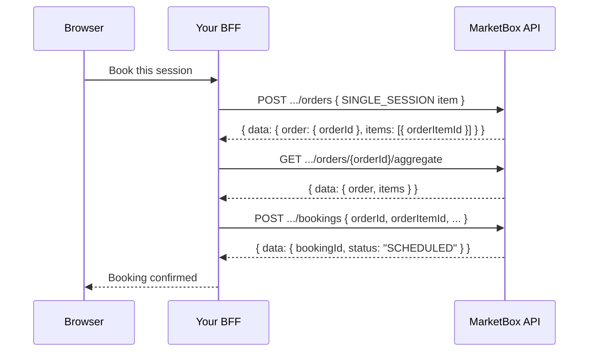

This guide walks through the single-session booking flow end to end: create
an order, read the order item it produced, then create the booking that
consumes it.

It builds on [The booking engine model](/concepts/booking-engine-model) —
read that first if you haven't. The one rule to keep in mind here: **you
can't create a booking without an order item to draw down.** For a single
session, that means one order with one `SINGLE_SESSION` item, funding exactly
one booking. This guide also assumes the [BFF pattern](/guides/booking-flow-auth#the-bff-pattern)
and an API key already set up.

## How it works

A single booking is three calls, always in this order:

1. **Create the order** with one `SINGLE_SESSION` item. This is what makes
   the session purchasable — it's the order item the booking will draw down.
2. **Read the order item's id.** The order-create response already includes
   it, but if the booking step runs later or in a different request, look it
   up again with the aggregate endpoint.
3. **Create the booking**, with the service line carrying
   `businessModelType: "SINGLE_BOOKING"` plus the `orderId` and `orderItemId`
   from steps 1–2.



<Note>
**Payment is not required.** Credits exist the moment the order is created,
not when it's paid. The order stays `DRAFT` and the booking still succeeds —
don't gate booking on Stripe. Layer payment on afterward with
[Accept payments with Stripe](/guides/accept-payments-with-stripe).
</Note>

<Note>
**`POST /bookings` books immediately — there's no reservation window.** To
reserve this supplier's time while the customer pays, hold it first:
`POST /holds { intervals: [...] }`, then convert the hold into this same
booking on payment success. A single session can be held on its own — no
package, no slate. See
[Hold slots during checkout](/guides/hold-slots-for-checkout).

If you *do* hold the time, you must convert it: this route will not consume
your hold and returns `409 SLOT_HELD` naming the `reservationId` you
created.
</Note>

<Steps>
<Step title="Create the order">
Create an order with a single `SINGLE_SESSION` item naming the service and
offering being booked. You don't send a price — the server prices the item
from the offering itself.

```ts
// app/api/bff/orders/route.ts
import { NextResponse } from 'next/server';

export async function POST(request: Request) {
  const { clientId } = await request.json();

  const res = await fetch(
    `${process.env.API_BASE_URL}/v1/projects/${process.env.PROJECT_ID}/orders`,
    {
      method: 'POST',
      headers: {
        'x-api-key': process.env.MARKETBOX_API_KEY!, // server-only
        'content-type': 'application/json',
      },
      body: JSON.stringify({
        clientId,
        currency: 'CAD',
        items: [
          {
            skuType: 'SINGLE_SESSION',
            serviceId: 'srv_01kv60qg12e82acr78edfnjhvv',
            offeringId: 'off_01kv60qge5eh59ap0gw0pqrrys',
            quantity: 1,
          },
        ],
      }),
    },
  );

  const body = await res.json().catch(() => ({}));
  return NextResponse.json(body, { status: res.status });
}
```

The response nests the order under `order`, not at the top level:

```json
{
  "data": {
    "order": {
      "orderId": "ord_01kx16ek2jf4r9da74adf6m4h0",
      "status": "DRAFT",
      "total": { "amount": 4000, "currency": "CAD" }
    },
    "items": [
      {
        "orderItemId": "oi_01kx16ek2kf2fsc9x7b2n1dfc9",
        "skuType": "SINGLE_SESSION",
        "quantity": 1,
        "quantityRemaining": 1,
        "unitPrice": { "amount": 4000, "currency": "CAD" }
      }
    ],
    "summary": { "total": { "amount": 4000, "currency": "CAD" }, "amountDue": { "amount": 4000, "currency": "CAD" } }
  }
}
```

<Warning>
The order id is at `data.order.orderId`, **not** `data.orderId`. This trips
up naive `res.data.orderId` unwrapping — every order response is shaped
`{ order, items, summary }`.
</Warning>
</Step>

<Step title="Get the order item id">
You already have `orderItemId` from the create response above — for a
single, immediate checkout you can skip straight to Step 3. If the booking
step happens later, or in a separate request that only has the `orderId`,
fetch it again with the aggregate endpoint:

```ts
// app/api/bff/orders/[orderId]/route.ts
import { NextResponse } from 'next/server';

export async function GET(
  _req: Request,
  ctx: { params: Promise<{ orderId: string }> },
) {
  const { orderId } = await ctx.params;

  const res = await fetch(
    `${process.env.API_BASE_URL}/v1/projects/${process.env.PROJECT_ID}/orders/${orderId}/aggregate`,
    { headers: { 'x-api-key': process.env.MARKETBOX_API_KEY! } },
  );

  const body = await res.json().catch(() => ({}));
  return NextResponse.json(body, { status: res.status });
}
```

Same shape as the create response — `data.order` plus `data.items[]`. Read
the `SINGLE_SESSION` item's `orderItemId` off `data.items[0].orderItemId`.
</Step>

<Step title="Create the booking">
Create the booking. The service line carries `businessModelType:
"SINGLE_BOOKING"` plus the `orderId`/`orderItemId` pair from steps 1–2 — this
is what ties the schedule entry back to the order item it draws down. The
example below uses `locationType: "TRAVEL_ZONE"`, which needs the most
fields; see the location rules warning below for `PHYSICAL` and `VIRTUAL`.

```ts
// app/api/bff/bookings/route.ts
import { NextResponse } from 'next/server';

export async function POST(request: Request) {
  const { clientId, orderId, orderItemId } = await request.json();

  const res = await fetch(
    `${process.env.API_BASE_URL}/v1/projects/${process.env.PROJECT_ID}/bookings`,
    {
      method: 'POST',
      headers: {
        'x-api-key': process.env.MARKETBOX_API_KEY!, // server-only
        'content-type': 'application/json',
      },
      body: JSON.stringify({
        clientId,
        supplierId: 'sup_01kv60qgnef2kt3pvqgwmkbzfr',
        bookingStartUtc: '2026-07-09T13:30:00.000Z',
        bookingEndUtc: '2026-07-09T14:00:00.000Z',
        bookingTz: 'America/Toronto',
        locationType: 'TRAVEL_ZONE',
        locationId: 'stz_01kv60qgs4e4nbjhzradnqtj0h', // supplierTravelZoneId
        latitude: 43.6532,
        longitude: -79.3832,
        address: {
          addressOneLine: '123 Queen St W, Toronto, ON M5H 2M9, Canada',
          streetNumber: '123',
          streetName: 'Queen St W',
          city: 'Toronto',
          state: 'ON',
          country: 'CA',
          zipCode: 'M5H 2M9',
        },
        capacity: 1,
        services: [
          {
            serviceId: 'srv_01kv60qg12e82acr78edfnjhvv',
            offeringId: 'off_01kv60qge5eh59ap0gw0pqrrys',
            businessModelType: 'SINGLE_BOOKING',
            quantity: 1,
            orderId,
            orderItemId,
          },
        ],
      }),
    },
  );

  const body = await res.json().catch(() => ({}));
  return NextResponse.json(body, { status: res.status });
}
```

A successful response returns the created booking, `status: "SCHEDULED"`:

```json
{
  "data": {
    "bookingId": "bk_01kx16f2a0e5x9jv6r0c1qs7pm",
    "status": "SCHEDULED",
    "supplierId": "sup_01kv60qgnef2kt3pvqgwmkbzfr",
    "clientId": "clt_dolphin_web",
    "bookingStartUtc": "2026-07-09T13:30:00.000Z",
    "bookingEndUtc": "2026-07-09T14:00:00.000Z",
    "bookingLocalDate": "2026-07-09",
    "bookingLocalStartTime": "09:30",
    "services": [
      {
        "serviceId": "srv_01kv60qg12e82acr78edfnjhvv",
        "offeringId": "off_01kv60qge5eh59ap0gw0pqrrys",
        "businessModelType": "SINGLE_BOOKING",
        "orderId": "ord_01kx16ek2jf4r9da74adf6m4h0",
        "orderItemId": "oi_01kx16ek2kf2fsc9x7b2n1dfc9"
      }
    ]
  }
}
```

<Note>
The `bookingLocal*` fields are computed server-side from `bookingTz` — never
send them yourself. See [Timezones](/concepts/timezones).
</Note>
</Step>
</Steps>

<Warning>
**Location fields depend on `locationType`** — the API rejects the wrong
combination with a `400`:

| `locationType` | Required fields | Must be omitted |
| --- | --- | --- |
| `VIRTUAL` | none | `locationId`, `latitude`, `longitude` |
| `PHYSICAL` | `locationId` (a Location id) | `latitude`, `longitude` (derived from the Location) |
| `TRAVEL_ZONE` | `locationId` (the `supplierTravelZoneId`), `latitude`, `longitude`, and a structured `address` | — |

The `address` object (`addressOneLine`, `streetNumber`, `streetName`, `city`,
`state`, `country` as ISO-2, `zipCode`, plus optional `unitNumber`) is
required on every `TRAVEL_ZONE` booking — there's no fallback that derives it
for you on the single-booking path.
</Warning>

## Reference

### Endpoints used in this guide

| Endpoint | Method | Auth | Description |
| --- | --- | --- | --- |
| `/v1/projects/{projectId}/orders` | `POST` | `x-api-key` | Create the order and its `SINGLE_SESSION` item. Order id is nested at `data.order.orderId`. |
| `/v1/projects/{projectId}/orders/{orderId}/aggregate` | `GET` | `x-api-key` | Read the order plus its items — use this to (re)fetch `orderItemId`. |
| `/v1/projects/{projectId}/bookings` | `POST` | `x-api-key` | Create the booking. Each service line must reference an existing `orderId` + `orderItemId`. |

### Configuration

| Value | Env var | Browser? |
| --- | --- | --- |
| API key | `MARKETBOX_API_KEY` | **No** (server-only) |
| API base URL | `API_BASE_URL` | **No** (BFF-only) |
| Project id | `PROJECT_ID` | **No** (BFF-only) |

### Errors and edge cases

| Scenario | `code` | Status | Resolution |
| --- | --- | --- | --- |
| `orderId` doesn't exist, or belongs to another project | `INVALID_ORDER_REFERENCE` | `400` | Double-check the `orderId` came from a `POST /orders` call in the same project. |
| `orderItemId` doesn't exist on that order | `INVALID_ORDER_ITEM_REFERENCE` | `400` | Re-fetch the order aggregate — you may be reusing a stale id. |
| `orderItemId`'s service/offering doesn't match the booking's service line | `ORDER_ITEM_SERVICE_MISMATCH` | `400` | The `serviceId`/`offeringId` on the booking's service line must match the order item that funded it. |
| Order item has no quantity left to draw down | `ORDER_ITEM_QUANTITY_UNAVAILABLE` | `400` | A `SINGLE_SESSION` item only funds one booking. Create a new order for another session. |
| Offering isn't `ACTIVE` | `BAD_REQUEST` | `400` | Only active offerings can be booked or ordered. |
| Wrong location fields for `locationType` | `VALIDATION_ERROR` | `400` | Match the table above — e.g. sending `latitude` on a `PHYSICAL` booking, or omitting `address` on `TRAVEL_ZONE`. |
| `bookingEndUtc` not after `bookingStartUtc` | `BAD_REQUEST` | `400` | Fix the time window and retry. |
| The supplier's time is claimed by a live hold — very often **your own**, if you held it and then called this route instead of converting | `SLOT_HELD` | `409` | Read `conflicts[0].reservationId` and call `POST /holds/{reservationId}/convert` instead. If the hold isn't yours, `heldUntil` says when it lapses. See [Hold slots during checkout](/guides/hold-slots-for-checkout#handling-a-held-slot). |
| The supplier is already booked for that time | `SLOT_BOOKED` | `409` | `conflicts[0].bookingId` names the booking. Supplier time is exclusive — offer a different slot. |
| Heavy concurrent writes on one supplier-day exhausted the internal retry | `OCCUPANCY_CONTENTION` | `409` | Transient — retry the same request after a short backoff. See [Concurrency](/concepts/concurrency). |

See [Errors](/concepts/errors) for the full envelope and code list.
