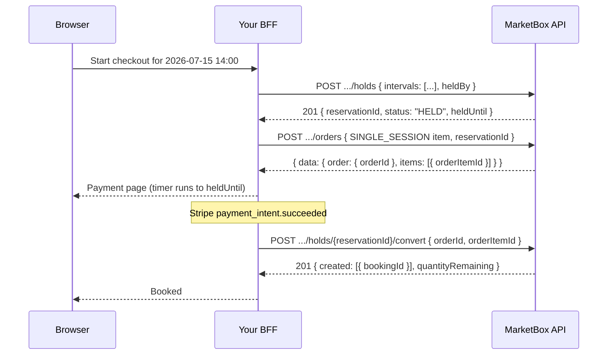

A **hold** is a claim on a supplier's time. It blocks that time for
everyone else — nobody can book it, hold it, or even see it as available —
until you either convert the hold into real bookings or it lapses. It is
what turns "the customer is on the payment page" into a state the booking
engine actually respects.

A hold works on **any** supplier time: one session, a cherry-picked subset
of a package slate, or a whole 8-session slate. Holding a single session
needs no package, no slate, and no `FLEXIBLE_PACKAGE` business model —
`POST /holds` with an explicit `intervals` array is all it takes. Convert
is one endpoint for both shapes: it reads the order item you name and
decides from its `skuType` whether it is booking one single session or N
package sessions.

It builds on [The booking engine model](/concepts/booking-engine-model) —
read that first if you haven't. Holds pair naturally with
[Accept payments with Stripe](/guides/accept-payments-with-stripe): hold,
charge, convert from the webhook. For the guard that makes any of this
mean anything, see [Concurrency](/concepts/concurrency).

<Note>
Every request path in this guide is
`{API_BASE_URL}/v1/projects/{PROJECT_ID}/...`, with the `x-api-key` header
attached server-side by your BFF — never in the browser. A hold names
supplier time and hands back a `reservationId` that can book that time;
it does not belong in a client bundle.
</Note>

<Warning>
**If you hold, you convert.** The direct booking routes (`POST /bookings`
and `POST /orders/{orderId}/package-bookings`) know nothing about holds and
will **not** consume one — not even your own. Call them for time you hold
and they return `409 SLOT_HELD`, naming the very `reservationId` you
created. Once you have held time, the only way to book it is
`POST /holds/{reservationId}/convert`. See
[Handling a held slot](#handling-a-held-slot) below.
</Warning>

## How it works

A checkout with a hold is three calls, always in this order:

1. **Hold the time.** `POST /holds` with exactly one of `intervals` (an
   explicit list of supplier time — the single-session form; each interval
   carries the same location contract as a booking), `slateId` (every slot
   of a package slate), or `slotIds` (a cherry-picked subset). Returns a
   `reservationId` and a `heldUntil`.
2. **Create the order and take payment.** An order with a
   `SINGLE_SESSION` item (for a one-session hold) or a `PACKAGE` item (for
   a multi-session hold) is what funds the bookings. Charge the customer
   however you already do. Pass this hold's `reservationId` on the
   order-create call — it's the preferred region source, so the order
   prices off the exact location the hold (and the eventual bookings)
   already carry. See [Regional pricing](/concepts/regional-pricing).
3. **Convert.** `POST /holds/{reservationId}/convert` with
   `{ orderId, orderItemId }` — call it from your payment webhook. It is
   idempotent on the `reservationId`, so a webhook that fires twice replays
   the same bookings instead of double-booking.

If the customer abandons, `POST /holds/{reservationId}/release` frees the
time immediately.



<Steps>
<Step title="Hold a single session">
Send `intervals` — an explicit list of supplier time. This is the general
form and the one to reach for when there is no package involved: a single
session can now be held on its own, with nothing but a `supplierId` and a
UTC window.

Every interval carries the **same location contract as a booking** —
`bookingTz` and `locationType` are **required**, and `locationType` decides
which of `locationId` / `latitude` / `longitude` / `address` must come with
it. That isn't ceremony: convert rebuilds the booking from the
**reservation alone** (never by re-reading a slate that may have expired
while your customer was paying), so whatever the booking will need, the
hold has to be holding already.

| `locationType` | Required alongside it | Must be omitted / null |
| --- | --- | --- |
| `VIRTUAL` | nothing | `locationId`, `latitude`, `longitude` |
| `PHYSICAL` | `locationId` — a **Location** id (`loc_…`) | `latitude`, `longitude` (derived from the Location record) |
| `TRAVEL_ZONE` | `locationId` — the **`supplierTravelZoneId`** (`stz_…`) — plus `latitude`, `longitude` and a structured `address` | — |

These are the rules on `POST /bookings`, unchanged — see the location table
in [Create a single booking](/guides/create-a-single-booking#reference) and
the `address` shape in [Booking addresses](/guides/booking-addresses).

`heldBy` is who owns the hold — use your checkout session id. It is the
key to the heartbeat in Step 3, and convert must present the same value.

```ts
// app/api/bff/holds/route.ts
import { NextResponse } from 'next/server';

export async function POST(request: Request) {
  const { supplierId, startUtc, endUtc, checkoutSessionId } =
    await request.json();

  const res = await fetch(
    `${process.env.API_BASE_URL}/v1/projects/${process.env.PROJECT_ID}/holds`,
    {
      method: 'POST',
      headers: {
        'x-api-key': process.env.MARKETBOX_API_KEY!, // server-only
        'content-type': 'application/json',
      },
      body: JSON.stringify({
        intervals: [
          {
            supplierId,
            startUtc,
            endUtc,
            bookingTz: 'America/Toronto', // required
            locationType: 'PHYSICAL', // required
            locationId: 'loc_01kx16f2a0h8a2my9u3f4tv0sp', // a Location id
            // no latitude/longitude — PHYSICAL derives them from the Location
          },
        ],
        heldBy: checkoutSessionId,
        holdDurationMins: 10,
      }),
    },
  );

  const body = await res.json().catch(() => ({}));
  return NextResponse.json(body, { status: res.status });
}
```

A successful hold returns `201` with the reservation and the exact time —
and the exact place — it claims. The response **echoes the full interval
shape back**, so you can verify what convert will build the booking from:

```json
{
  "reservationId": "resv_01k8p20m1gnqvxl92xln6awk8",
  "status": "HELD",
  "heldUntil": "2026-07-11T12:10:00.000Z",
  "intervals": [
    {
      "supplierId": "sup_01kv60qgnef2kt3pvqgwmkbzfr",
      "startUtc": "2026-07-15T14:00:00.000Z",
      "endUtc": "2026-07-15T15:00:00.000Z",
      "bookingTz": "America/Toronto",
      "locationType": "PHYSICAL",
      "locationId": "loc_01kx16f2a0h8a2my9u3f4tv0sp",
      "latitude": null,
      "longitude": null,
      "address": null
    }
  ]
}
```

<Warning>
**`locationId` alone is not enough — and an `stz_` id is not a Location.**
A mobile / in-home session's `locationId` is a **supplier travel zone**
(`stz_…`), which lives in a different table from a `Location` (`loc_…`).
`locationType` is what tells convert which one it is holding. Send an
`stz_` id with `locationType: "PHYSICAL"` and convert will look it up in
Locations and fail with `404 Location stz_… not found`. See
[A travel-zone checkout, end to end](#a-travel-zone-checkout-end-to-end).
</Warning>

<Note>
**Exactly one of `intervals`, `slateId`, or `slotIds`.** Sending two (or
none) is a `400 VALIDATION_ERROR`. `holdDurationMins` is optional and
resolves: your value → the offering's `holdDurationMinsOverride` (slate and
slot forms only, where an offering is known) → the project's
`suggestionConfig.holdDurationMins` → **5 minutes**.
</Note>

<Tip>
Every interval in one request is claimed in a **single transaction** — a
hold is all-or-nothing. You never end up holding 3 sessions of a
5-session package and having to unwind it yourself.
</Tip>
</Step>

<Step title="Hold a package slate instead">
Same endpoint, same response shape — swap `intervals` for the `slateId`
returned by `POST /availability/package-slate` (see
[Create a package booking](/guides/create-a-package-booking)). Every slot
of the slate is held at once. Pass `slotIds` instead to cherry-pick a
subset.

**No location fields at all on this form.** The slate's persisted slots
already carry `bookingTz`, `locationType`, `locationId`, coordinates and
`address`, and the hold copies them onto the reservation for you. The
required fields introduced above apply **only** to the explicit `intervals`
form — package integrators send exactly what they always sent.

```ts
// app/api/bff/holds/route.ts
import { NextResponse } from 'next/server';

export async function POST(request: Request) {
  const { slateId, checkoutSessionId } = await request.json();

  const res = await fetch(
    `${process.env.API_BASE_URL}/v1/projects/${process.env.PROJECT_ID}/holds`,
    {
      method: 'POST',
      headers: {
        'x-api-key': process.env.MARKETBOX_API_KEY!, // server-only
        'content-type': 'application/json',
      },
      body: JSON.stringify({
        slateId, // e.g. 'slate_01kx16ejsqffc9rbgdcc591w2p'
        heldBy: checkoutSessionId,
      }),
    },
  );

  const body = await res.json().catch(() => ({}));
  return NextResponse.json(body, { status: res.status });
}
```

The hold carries one interval per session — each one echoed with the
location the slate resolved for it (abridged here to the first of eight;
this slate was built on the lat/lng branch, so its slots are `TRAVEL_ZONE`):

```json
{
  "reservationId": "resv_01k8p22ffc9rbgdcc591w2p3q",
  "status": "HELD",
  "heldUntil": "2026-07-11T12:05:00.000Z",
  "intervals": [
    {
      "supplierId": "sup_01kv60qgnef2kt3pvqgwmkbzfr",
      "startUtc": "2026-07-15T13:30:00.000Z",
      "endUtc": "2026-07-15T14:00:00.000Z",
      "bookingTz": "America/Toronto",
      "locationType": "TRAVEL_ZONE",
      "locationId": "stz_01kv60qgs4e4nbjhzradnqtj0h",
      "latitude": 43.6532,
      "longitude": -79.3832,
      "address": {
        "addressOneLine": "100 Queen St W, Toronto, ON M5H 2N2, Canada",
        "streetNumber": "100",
        "streetName": "Queen St W",
        "city": "Toronto",
        "state": "ON",
        "country": "CA",
        "zipCode": "M5H 2N2"
      }
    }
  ]
}
```

<Note>
Slates stay resolvable for **24 hours** after they're built. Holding a
stale `slateId` (or one from another project) is a `409` with
`SUGGESTION_EXPIRED`, `SLATE_NOT_FOUND`, or `SLOT_NOT_FOUND` — rebuild the
slate rather than retrying.
</Note>
</Step>

<Step title="Keep the hold alive while the customer pays">
Expiry is **lazy**. Nothing runs at `heldUntil` — no sweeper, no webhook,
no status change. The hold simply stops blocking anyone at that instant,
and the time is up for grabs again. A hold read after its `heldUntil` may
still report `status: "HELD"`; compare `heldUntil` against the current time
rather than trusting `status` alone.

So: **convert before `heldUntil`**, or extend. To extend, re-POST to
`/holds` with **the same intervals, the same `heldBy`, and the
`reservationId` you were given**. That is your checkout heartbeat: the
existing hold's `heldUntil` moves out, the same `reservationId` comes back,
and no second hold is minted — so the id you convert later is still the
right one.

<Warning>
**Thread the location fields through the heartbeat too.** The heartbeat
re-sends `intervals`, and `intervals` are validated the same way on every
call: an interval without `bookingTz` and `locationType` is a
`400 VALIDATION_ERROR`, heartbeat or not. Keep the array you built in Step 1
verbatim (or replay the `intervals` the `201` echoed back at you) — don't
rebuild a trimmed `{ supplierId, startUtc, endUtc }` version for the
heartbeat.
</Warning>

```ts
// app/api/bff/holds/heartbeat/route.ts
import { NextResponse } from 'next/server';

export async function POST(request: Request) {
  const { reservationId, intervals, checkoutSessionId } = await request.json();

  // Same intervals (FULL shape — bookingTz + locationType + location fields),
  // same heldBy, plus the reservationId. The server EXTENDS that reservation
  // instead of minting a second hold.
  const res = await fetch(
    `${process.env.API_BASE_URL}/v1/projects/${process.env.PROJECT_ID}/holds`,
    {
      method: 'POST',
      headers: {
        'x-api-key': process.env.MARKETBOX_API_KEY!, // server-only
        'content-type': 'application/json',
      },
      body: JSON.stringify({
        reservationId, // omit this and you mint a NEW hold
        intervals, // e.g. [{ supplierId, startUtc, endUtc, bookingTz,
        //                    locationType, locationId, latitude,
        //                    longitude, address }]
        heldBy: checkoutSessionId,
        holdDurationMins: 10,
      }),
    },
  );

  const body = await res.json().catch(() => ({}));
  return NextResponse.json(body, { status: res.status });
}
```

You can also read the hold at any point with `GET /holds/{reservationId}` —
it echoes the same full interval shape, which is the fastest way to check
what convert is actually going to build:

```json
{
  "reservationId": "resv_01k8p20m1gnqvxl92xln6awk8",
  "status": "HELD",
  "heldUntil": "2026-07-11T12:20:00.000Z",
  "intervals": [
    {
      "supplierId": "sup_01kv60qgnef2kt3pvqgwmkbzfr",
      "startUtc": "2026-07-15T14:00:00.000Z",
      "endUtc": "2026-07-15T15:00:00.000Z",
      "bookingTz": "America/Toronto",
      "locationType": "PHYSICAL",
      "locationId": "loc_01kx16f2a0h8a2my9u3f4tv0sp",
      "latitude": null,
      "longitude": null,
      "address": null
    }
  ]
}
```

<Warning>
A hold from a **different** `heldBy` over the same time is a conflict, not
an extension — you get `409 SLOT_HELD`. Keep `heldBy` stable for the life
of one checkout; don't regenerate it per request. Passing a `reservationId`
whose `heldBy` doesn't match yours is `409 RESERVATION_FORBIDDEN`; one that
is unknown is `409 RESERVATION_NOT_FOUND`; one already converted or released
is `409 RESERVATION_NOT_HELD`.
</Warning>
</Step>

<Step title="Convert the hold into bookings">
On payment success, convert. One endpoint for both shapes — you don't tell
it what you're booking, it reads the order item's `skuType`:

- a **`SINGLE_SESSION`** item books the one held interval as an ordinary
  single booking (`businessModelType: "SINGLE_BOOKING"`);
- a **`PACKAGE`** item books every held interval as package sessions,
  drawing down that item's credits.

The bookings are rebuilt from the **reservation** (supplier, time,
location) and the **order item** (client, service, offering, price) — never
by re-resolving a suggestion that may have expired — so the booked service
and the credit it draws down cannot disagree.

```ts
// app/api/bff/holds/convert/route.ts
import { NextResponse } from 'next/server';

export async function POST(request: Request) {
  const { reservationId, orderId, orderItemId, checkoutSessionId } =
    await request.json();

  const res = await fetch(
    `${process.env.API_BASE_URL}/v1/projects/${process.env.PROJECT_ID}/holds/${reservationId}/convert`,
    {
      method: 'POST',
      headers: {
        'x-api-key': process.env.MARKETBOX_API_KEY!, // server-only
        'content-type': 'application/json',
      },
      body: JSON.stringify({
        orderId,
        orderItemId,
        heldBy: checkoutSessionId, // must match the hold's heldBy
        atomicity: 'all_or_nothing',
      }),
    },
  );

  const body = await res.json().catch(() => ({}));
  return NextResponse.json(body, { status: res.status });
}
```

A successful convert returns `201` with one entry per booked session:

```json
{
  "orderId": "ord_01k16f0a1c7b2sd91xzq3mn5p",
  "orderItemId": "oi_01k16f0a1d8c3se02yzq4mn6q",
  "packageOrderItemId": null,
  "atomicity": "all_or_nothing",
  "created": [
    {
      "sessionIndex": 0,
      "bookingId": "bk_01k16f2a0e5x9jv6r0c1qs7pm",
      "allocationId": "alloc_01k16f2a0f6y0kw7s1d2rt8qn"
    }
  ],
  "failed": [],
  "quantityRemaining": 0
}
```

<Warning>
**This response is NOT wrapped in `{ data }`**, unlike orders and bookings.
Read `created`, `failed`, and `quantityRemaining` directly off the body.
`created[].sessionIndex` is **0-based** (a slate's `slots[].sessionIndex`
is 1-based — don't compare them without adjusting).
</Warning>

<Tip>
**Convert is idempotent — call it from the webhook.** It is keyed
internally on `convert:<reservationId>`, and the reservation flip is atomic
with the booking write, so a Stripe webhook that fires twice replays the
same bookings rather than creating a second set. An already-`CONVERTED`
reservation short-circuits and returns its stored result. Don't try to
de-duplicate this yourself.
</Tip>

<Note>
Convert too late and you get `409 HOLD_EXPIRED` — the hold stopped blocking
at `heldUntil` and the time may have gone. If it's still free, hold it
again and convert the new reservation; if someone took it, you'll see
`SLOT_BOOKED` instead.
</Note>
</Step>

<Step title="Release, if the customer abandons">
Don't wait for lazy expiry when you already know the checkout is dead —
release, and the supplier's time is bookable again immediately.

```ts
// app/api/bff/holds/release/route.ts
import { NextResponse } from 'next/server';

export async function POST(request: Request) {
  const { reservationId } = await request.json();

  const res = await fetch(
    `${process.env.API_BASE_URL}/v1/projects/${process.env.PROJECT_ID}/holds/${reservationId}/release`,
    {
      method: 'POST',
      headers: { 'x-api-key': process.env.MARKETBOX_API_KEY! }, // server-only
    },
  );

  const body = await res.json().catch(() => ({}));
  return NextResponse.json(body, { status: res.status });
}
```

```json
{ "reservationId": "resv_01k8p20m1gnqvxl92xln6awk8", "status": "RELEASED" }
```

<Note>
Release is **idempotent and never an error** — always `200`. An already
released hold returns `RELEASED`; an already converted one returns
`CONVERTED` (it is booked and cannot be un-booked this way); an unknown
`reservationId` returns `NOT_FOUND`. All three are terminal states, not
failures — safe to call blindly on an abandon/cleanup path.
</Note>
</Step>

</Steps>

## A travel-zone checkout, end to end

A **mobile / in-home** session — the supplier travels to the client — is the
flow with the most moving parts, because `locationId` is a
`supplierTravelZoneId` (`stz_…`) rather than a `Location`, and the client's
coordinates and street address are what the supplier actually navigates to.
All of it has to be on the hold, because convert builds the booking from the
hold.

<Steps>
<Step title="Hold the travel-zone session">
`locationType: "TRAVEL_ZONE"` + the `stz_` zone id + `latitude` +
`longitude` + the full structured `address`. Miss any one of them and the
hold is rejected with a `400` before anything is claimed.

```json
{
  "intervals": [
    {
      "supplierId": "sup_01kv60qgnef2kt3pvqgwmkbzfr",
      "startUtc": "2026-07-15T14:00:00.000Z",
      "endUtc": "2026-07-15T15:00:00.000Z",
      "bookingTz": "America/Toronto",
      "locationType": "TRAVEL_ZONE",
      "locationId": "stz_01kv60qgs4e4nbjhzradnqtj0h",
      "latitude": 43.6532,
      "longitude": -79.3832,
      "address": {
        "addressOneLine": "100 Queen St W, Toronto, ON M5H 2N2, Canada",
        "streetNumber": "100",
        "streetName": "Queen St W",
        "city": "Toronto",
        "state": "ON",
        "country": "CA",
        "zipCode": "M5H 2N2"
      }
    }
  ],
  "heldBy": "checkout_9f2c1b",
  "holdDurationMins": 10
}
```

The `201` echoes every one of those fields back on `intervals[0]` — if
`locationType` or `address` come back `null`, you didn't send them, and the
convert in Step 3 will fail. Check the echo, don't assume.
</Step>

<Step title="Create the order and charge the customer">
Nothing travel-zone-specific here: an order with one `SINGLE_SESSION` item
for the service and offering being sold, plus this hold's `reservationId`,
then your usual Stripe flow. The address you sent to `/holds` is the
*session's* address — it is not the order's billing address and is not sent
again on the order; passing `reservationId` is what lets the order read that
same address back out to resolve the same regional price the booking will
use. See [Regional pricing](/concepts/regional-pricing).

Heartbeat the hold while the payment page is open (Step 3 above), re-sending
these same intervals **with all their location fields** plus the
`reservationId`.
</Step>

<Step title="Convert on payment success">
```json
{
  "orderId": "ord_01k16f0a1c7b2sd91xzq3mn5p",
  "orderItemId": "oi_01k16f0a1d8c3se02yzq4mn6q",
  "heldBy": "checkout_9f2c1b",
  "atomicity": "all_or_nothing"
}
```

Convert reads `locationType: "TRAVEL_ZONE"` off the reservation, so it
**does not** try to resolve `stz_01kv60qgs4e4nbjhzradnqtj0h` as a Location.
It writes the booking with the held zone, coordinates and address, derives
`bookingLocalDate` / `bookingLocalStartTime` / … from `bookingTz`, and — for
travel-zone work — prices the offering from the *client's* region
(`address.country` / `address.state` / `address.zipCode`), because there is
no Location record to price against.

```json
{
  "orderId": "ord_01k16f0a1c7b2sd91xzq3mn5p",
  "orderItemId": "oi_01k16f0a1d8c3se02yzq4mn6q",
  "packageOrderItemId": null,
  "atomicity": "all_or_nothing",
  "created": [
    {
      "sessionIndex": 0,
      "bookingId": "bk_01k16f2a0e5x9jv6r0c1qs7pm",
      "allocationId": "alloc_01k16f2a0f6y0kw7s1d2rt8qn"
    }
  ],
  "failed": [],
  "quantityRemaining": 0
}
```
</Step>
</Steps>

<Warning>
**`404 Location stz_… not found` on convert.** This means the hold was
placed with an `stz_` travel-zone id but **`locationType: "PHYSICAL"`, or no
`locationType` at all** — so convert looked the id up in the Locations table,
where a travel zone does not exist. It is not a data problem and there is
nothing to retry: fix the *hold*. Release the reservation, re-hold with
`locationType: "TRAVEL_ZONE"` (plus `latitude`, `longitude`, `address`), and
convert the new `reservationId`. Confirm with `GET /holds/{reservationId}`
that `intervals[0].locationType` reads `TRAVEL_ZONE` before you convert.
</Warning>

## Handling a held slot

This is the one error worth memorising, because it is the shape of the
most common mistake: you hold time, then call `POST /bookings` (or
`POST .../package-bookings`) for that same time, and you are blocked **by
your own hold**. The direct booking routes never consume a hold. They
return `409`:

```json
{
  "code": "SLOT_HELD",
  "message": "Supplier time is not available: HOLD resv_01k8p20m1gnqvxl92xln6awk8 (2026-07-15T14:00:00.000Z–2026-07-15T15:00:00.000Z)",
  "conflicts": [
    {
      "claimType": "HOLD",
      "supplierId": "sup_01kv60qgnef2kt3pvqgwmkbzfr",
      "startUtc": "2026-07-15T14:00:00.000Z",
      "endUtc": "2026-07-15T15:00:00.000Z",
      "reservationId": "resv_01k8p20m1gnqvxl92xln6awk8",
      "bookingId": null,
      "heldUntil": "2026-07-11T12:10:00.000Z"
    }
  ],
  "hint": "This time is held (reservation resv_01k8p20m1gnqvxl92xln6awk8). Convert the hold via POST /v1/projects/{projectId}/holds/{reservationId}/convert, or release it with POST /v1/projects/{projectId}/holds/{reservationId}/release. Direct booking routes will not consume a hold — if you hold, you convert."
}
```

The body hands you everything you need. Take
`conflicts[0].reservationId` and:

- **It's your hold** (the reservation you created for this checkout) →
  don't retry the booking call. Call
  `POST /holds/{reservationId}/convert` with your `orderId` and
  `orderItemId` instead. That is the booking.
- **It's not yours** (another customer is mid-checkout) → the time is
  genuinely taken for now. `heldUntil` tells you when it lapses. Offer a
  different slot; don't spin on the same one.

`SLOT_BOOKED` is the same shape with `claimType: "BOOKING"` and a
`bookingId` instead — a confirmed booking is in the way, and no amount of
converting will move it. Search availability again.

<Tip>
The reverse mistake — holding and then converting — has no trap: convert
consumes your own hold by design, and any *other* live claim over the same
time still blocks it with the same `SLOT_HELD` / `SLOT_BOOKED` body.
</Tip>

## Troubleshooting

Every failure below is deterministic and tells you what to fix. Nothing here
except `OCCUPANCY_CONTENTION` is worth retrying unchanged.

### Placing or extending a hold — `POST /holds`

| Status | `code` | What it means | What to do |
| --- | --- | --- | --- |
| `400` | `VALIDATION_ERROR` | An interval is missing `bookingTz`. | Send the IANA zone the session happens in (`"America/Toronto"`). It is required on every interval — the booking's local times are derived from it at convert. |
| `400` | `VALIDATION_ERROR` | An interval is missing `locationType`. | Send `VIRTUAL`, `PHYSICAL`, or `TRAVEL_ZONE`. There is no default: it is what tells convert whether `locationId` names a Location or a travel zone. |
| `400` | `VALIDATION_ERROR` (`path: ["address"]`, `["latitude"]`, `["longitude"]`, `["locationId"]`) | `TRAVEL_ZONE` without the `stz_` `locationId`, `latitude`, `longitude`, **or** the structured `address`. | All four are mandatory for `TRAVEL_ZONE`. Full `address` shape in [Booking addresses](/guides/booking-addresses) (note: `zipCode`, not `postalCode`). |
| `400` | `VALIDATION_ERROR` (`locationId must be null for VIRTUAL sessions`) | A `VIRTUAL` interval carried `locationId`, `latitude`, or `longitude`. | Drop all three. A virtual session has no place. |
| `400` | `VALIDATION_ERROR` (`latitude must not be supplied for PHYSICAL sessions`) | A `PHYSICAL` interval carried coordinates. | Drop `latitude`/`longitude` — they're derived from the `Location` record named by `locationId` (a `loc_…` id, which is required). |
| `400` | `VALIDATION_ERROR` | More than one — or none — of `intervals` / `slateId` / `slotIds`. | Provide exactly one. |
| `409` | `SLOT_HELD` | The time is claimed by a live hold. **Very often your own**, if you called a direct booking route instead of convert. | `conflicts[0].reservationId` names it. Yours → convert it. Someone else's → `heldUntil` says when it lapses; offer another slot. See [Handling a held slot](#handling-a-held-slot). |
| `409` | `SLOT_BOOKED` | A confirmed booking occupies the time. | `conflicts[0].bookingId` names it. Gone for good — search availability again. |
| `409` | `SLOT_NOT_FOUND` / `SLATE_NOT_FOUND` / `SUGGESTION_EXPIRED` / `EMPTY_SLATE` | The `slateId` / `slotIds` you're holding is unknown, from another project, or past its 24-hour resolvable window. | Rebuild the slate with `POST /availability/package-slate` and hold the fresh one. Don't retry the stale id. |
| `409` | `RESERVATION_NOT_FOUND` | You passed a `reservationId` to extend and no such hold exists in this project. | Drop `reservationId` to mint a new hold. |
| `409` | `RESERVATION_NOT_HELD` | The `reservationId` you're extending is already `CONVERTED` or `RELEASED`. | Terminal. Start a fresh hold (or, if it converted, you're already booked — check `GET /holds/{reservationId}`). |
| `409` | `RESERVATION_FORBIDDEN` | The `heldBy` you sent doesn't own that `reservationId`. | Send the same `heldBy` the hold was created with. Keep it stable for the whole checkout. |
| `409` | `OCCUPANCY_CONTENTION` | Heavy concurrent writes on that supplier's day exhausted the internal retry. | **Retryable.** Resend the same request after a short jittered backoff (50–200 ms). |

### Converting a hold — `POST /holds/{reservationId}/convert`

| Status | `code` | What it means | What to do |
| --- | --- | --- | --- |
| `404` | `NOT_FOUND` — **`Location stz_… not found`** | The hold carried an `stz_` travel-zone id but `locationType: "PHYSICAL"` (or no `locationType`), so convert looked for it in Locations. | Re-hold with `locationType: "TRAVEL_ZONE"` + `latitude` + `longitude` + `address`, then convert the new `reservationId`. This is the classic broken in-home checkout — see the [travel-zone walkthrough](#a-travel-zone-checkout-end-to-end). |
| `404` | `NOT_FOUND` | The `orderItemId` isn't on that order, or the item's offering no longer exists. | Re-read the order with `GET /orders/{orderId}/aggregate`. |
| `400` | `INVALID_ORDER_REFERENCE` | The `orderId` doesn't exist in this project. | Create the order first — convert draws credits from its item. |
| `400` | `MISSING_BOOKING_TZ` | The hold carried no `bookingTz` and none could be derived. | Only reachable on holds placed before `bookingTz` was required. Release and re-hold with `bookingTz`. |
| `400` | `UNSUPPORTED_SKU_TYPE` | The order item is `SUBSCRIPTION` / `MEMBERSHIP` / `DEPOSIT`. | Only `SINGLE_SESSION` and `PACKAGE` items fund bookings. |
| `400` | `BAD_REQUEST` — `Offering … is not bookable (status: …)` | The item's offering is no longer `ACTIVE`. | Sell an active offering. The hold itself is fine — release it, or convert against a different order item. |
| `409` | `RESERVATION_MULTI_INTERVAL` | A `SINGLE_SESSION` order item was pointed at a hold covering more than one interval. | A `SINGLE_SESSION` item converts exactly **one** interval. Use a `PACKAGE` item for a multi-session hold — convert branches on the item's `skuType`, not on anything you pass. |
| `409` | `HOLD_EXPIRED` | You converted after `heldUntil`. Expiry is lazy — the hold simply stopped blocking. | Hold again and convert the new `reservationId`. If someone took the time meanwhile you'll get `SLOT_BOOKED` instead. |
| `409` | `RESERVATION_NOT_FOUND` / `RESERVATION_NOT_HELD` | Unknown `reservationId`, or one that was released. | Terminal — start a fresh hold. (An already-`CONVERTED` reservation is **not** an error: it replays its stored result. That's what makes the webhook safe.) |
| `409` | `RESERVATION_FORBIDDEN` | `heldBy` doesn't match the hold's owner. | Send the same `heldBy` you held with. |
| `409` | `SLOT_HELD` / `SLOT_BOOKED` | Someone else claimed the time while your customer was paying (only possible after your hold lapsed). | The time is gone. Refund or re-book onto a fresh slot. |
| `409` | `OCCUPANCY_CONTENTION` | Row contention on the supplier's day. | **Retryable** — convert is idempotent, so resending is safe. |
| `422` | `PACKAGE_SLATE_TOO_LARGE_FOR_ATOMIC` | More than 15 sessions with `atomicity: "all_or_nothing"`. | Use `atomicity: "best_effort"` (needs `suggestionConfig.allowPartialPackages`) or hold a smaller slate. |

<Note>
`GET /holds/{reservationId}` is your debugger. It returns the reservation
exactly as convert will read it — including `locationType`, `locationId`,
`latitude`, `longitude` and `address`. If a convert is failing, read the hold
first: nine times in ten the interval is missing the field the booking needs.
</Note>

## Reference

### Endpoints used in this guide

| Endpoint | Method | Auth | Description |
| --- | --- | --- | --- |
| `/v1/projects/{projectId}/holds` | `POST` | `x-api-key` | Hold supplier time. Exactly one of `intervals` (single session or any explicit time — each interval requires `bookingTz` + `locationType`), `slateId`, or `slotIds`. Pass `reservationId` to **extend** an existing hold. Returns `reservationId` + `heldUntil`. |
| `/v1/projects/{projectId}/holds/{reservationId}` | `GET` | `x-api-key` | Read a hold — `status`, `heldUntil`, and the full intervals it claims (including `locationType`, `locationId`, coordinates and `address`). |
| `/v1/projects/{projectId}/holds/{reservationId}/convert` | `POST` | `x-api-key` | Turn the hold into confirmed bookings against `{ orderId, orderItemId }`. Branches on the order item's `skuType`. Idempotent — safe for webhooks. Response is **not** wrapped in `{ data }`. |
| `/v1/projects/{projectId}/holds/{reservationId}/release` | `POST` | `x-api-key` | Free the time immediately. Idempotent — always `200`. |
| `/v1/projects/{projectId}/availability/package-slate` | `POST` | `x-api-key` | Build the slate whose `slateId` the package form holds. See [Availability and slates](/guides/availability-and-slates). |
| `/v1/projects/{projectId}/orders` | `POST` | `x-api-key` | Create the order whose item funds the conversion (`SINGLE_SESSION` or `PACKAGE`). |

### Configuration

| Value | Env var | Browser? |
| --- | --- | --- |
| API key | `MARKETBOX_API_KEY` | **No** (server-only) |
| API base URL | `API_BASE_URL` | **No** (BFF-only) |
| Project id | `PROJECT_ID` | **No** (BFF-only) |

### Interval fields (the `intervals` form)

| Field | Required | Notes |
| --- | --- | --- |
| `supplierId` | Yes | Whose time is being claimed. |
| `startUtc` / `endUtc` | Yes | UTC ISO-8601, `Z` suffix. `endUtc` is exclusive. |
| `bookingTz` | Yes | IANA zone. The booking's `bookingLocal*` fields are derived from it at convert. |
| `locationType` | Yes | `VIRTUAL` \| `PHYSICAL` \| `TRAVEL_ZONE`. Decides everything below. |
| `locationId` | `PHYSICAL` + `TRAVEL_ZONE` | A **Location** id (`loc_…`) for `PHYSICAL`; the **`supplierTravelZoneId`** (`stz_…`) for `TRAVEL_ZONE`. Null for `VIRTUAL`. |
| `latitude` / `longitude` | `TRAVEL_ZONE` only | Must be omitted for `PHYSICAL` (derived from the Location) and `VIRTUAL`. |
| `address` | `TRAVEL_ZONE` only | Structured — see [Booking addresses](/guides/booking-addresses). |

`slateId` and `slotIds` take **none** of these: the slate's slots already
carry them and the hold copies them onto the reservation.

### Errors and edge cases

See [Troubleshooting](#troubleshooting) above for the full status/code table
for both `POST /holds` and `POST /holds/{reservationId}/convert`, and
[Errors](/concepts/errors) for the envelope and the global code list.
