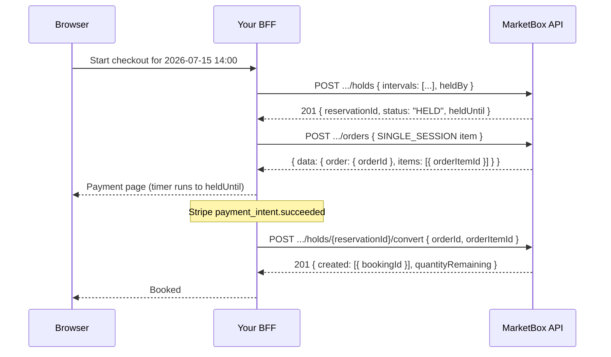

A **hold** is a claim on a supplier's time. It blocks that time for
everyone else — nobody can book it, hold it, or even see it as available —
until you either convert the hold into real bookings or it lapses. It is
what turns "the customer is on the payment page" into a state the booking
engine actually respects.

A hold works on **any** supplier time: one session, a cherry-picked subset
of a package slate, or a whole 8-session slate. Holding a single session
needs no package, no slate, and no `FLEXIBLE_PACKAGE` business model —
`POST /holds` with an explicit `intervals` array is all it takes. Convert
is one endpoint for both shapes: it reads the order item you name and
decides from its `skuType` whether it is booking one single session or N
package sessions.

It builds on [The booking engine model](/concepts/booking-engine-model) —
read that first if you haven't. Holds pair naturally with
[Accept payments with Stripe](/guides/accept-payments-with-stripe): hold,
charge, convert from the webhook. For the guard that makes any of this
mean anything, see [Concurrency](/concepts/concurrency).

<Note>
Every request path in this guide is
`{API_BASE_URL}/v1/projects/{PROJECT_ID}/...`, with the `x-api-key` header
attached server-side by your BFF — never in the browser. A hold names
supplier time and hands back a `reservationId` that can book that time;
it does not belong in a client bundle.
</Note>

<Warning>
**If you hold, you convert.** The direct booking routes (`POST /bookings`
and `POST /orders/{orderId}/package-bookings`) know nothing about holds and
will **not** consume one — not even your own. Call them for time you hold
and they return `409 SLOT_HELD`, naming the very `reservationId` you
created. Once you have held time, the only way to book it is
`POST /holds/{reservationId}/convert`. See
[Handling a held slot](#handling-a-held-slot) below.
</Warning>

## How it works

A checkout with a hold is three calls, always in this order:

1. **Hold the time.** `POST /holds` with exactly one of `intervals` (an
   explicit list of supplier time — the single-session form), `slateId`
   (every slot of a package slate), or `slotIds` (a cherry-picked subset).
   Returns a `reservationId` and a `heldUntil`.
2. **Create the order and take payment.** An order with a
   `SINGLE_SESSION` item (for a one-session hold) or a `PACKAGE` item (for
   a multi-session hold) is what funds the bookings. Charge the customer
   however you already do.
3. **Convert.** `POST /holds/{reservationId}/convert` with
   `{ orderId, orderItemId }` — call it from your payment webhook. It is
   idempotent on the `reservationId`, so a webhook that fires twice replays
   the same bookings instead of double-booking.

If the customer abandons, `POST /holds/{reservationId}/release` frees the
time immediately.



<Steps>
<Step title="Hold a single session">
Send `intervals` — an explicit list of supplier time. This is the general
form and the one to reach for when there is no package involved: a single
session can now be held on its own, with nothing but a `supplierId` and a
UTC window.

Supply `locationId` whenever you know it. A hold that carries a location
participates in travel-buffer logic exactly as a booking does; a hold
without one blocks only its exact interval — safe, but it won't stop the
engine suggesting an adjacent slot that's impossible to travel to.

`heldBy` is who owns the hold — use your checkout session id. It is the
key to the heartbeat in Step 2, and convert must present the same value.

```ts
// app/api/bff/holds/route.ts
import { NextResponse } from 'next/server';

export async function POST(request: Request) {
  const { supplierId, startUtc, endUtc, locationId, checkoutSessionId } =
    await request.json();

  const res = await fetch(
    `${process.env.API_BASE_URL}/v1/projects/${process.env.PROJECT_ID}/holds`,
    {
      method: 'POST',
      headers: {
        'x-api-key': process.env.MARKETBOX_API_KEY!, // server-only
        'content-type': 'application/json',
      },
      body: JSON.stringify({
        intervals: [{ supplierId, startUtc, endUtc, locationId }],
        heldBy: checkoutSessionId,
        holdDurationMins: 10,
      }),
    },
  );

  const body = await res.json().catch(() => ({}));
  return NextResponse.json(body, { status: res.status });
}
```

A successful hold returns `201` with the reservation and the exact time it
claims:

```json
{
  "reservationId": "resv_01k8p20m1gnqvxl92xln6awk8",
  "status": "HELD",
  "heldUntil": "2026-07-11T12:10:00.000Z",
  "intervals": [
    {
      "supplierId": "sup_01kv60qgnef2kt3pvqgwmkbzfr",
      "startUtc": "2026-07-15T14:00:00.000Z",
      "endUtc": "2026-07-15T15:00:00.000Z",
      "locationId": "stz_01kv60qgs4e4nbjhzradnqtj0h"
    }
  ]
}
```

<Note>
**Exactly one of `intervals`, `slateId`, or `slotIds`.** Sending two (or
none) is a `400 VALIDATION_ERROR`. `holdDurationMins` is optional and
resolves: your value → the offering's `holdDurationMinsOverride` (slate and
slot forms only, where an offering is known) → the project's
`suggestionConfig.holdDurationMins` → **5 minutes**.
</Note>

<Tip>
Every interval in one request is claimed in a **single transaction** — a
hold is all-or-nothing. You never end up holding 3 sessions of a
5-session package and having to unwind it yourself.
</Tip>
</Step>

<Step title="Hold a package slate instead">
Same endpoint, same response shape — swap `intervals` for the `slateId`
returned by `POST /availability/package-slate` (see
[Create a package booking](/guides/create-a-package-booking)). Every slot
of the slate is held at once. Pass `slotIds` instead to cherry-pick a
subset.

```ts
// app/api/bff/holds/route.ts
import { NextResponse } from 'next/server';

export async function POST(request: Request) {
  const { slateId, checkoutSessionId } = await request.json();

  const res = await fetch(
    `${process.env.API_BASE_URL}/v1/projects/${process.env.PROJECT_ID}/holds`,
    {
      method: 'POST',
      headers: {
        'x-api-key': process.env.MARKETBOX_API_KEY!, // server-only
        'content-type': 'application/json',
      },
      body: JSON.stringify({
        slateId, // e.g. 'slate_01kx16ejsqffc9rbgdcc591w2p'
        heldBy: checkoutSessionId,
      }),
    },
  );

  const body = await res.json().catch(() => ({}));
  return NextResponse.json(body, { status: res.status });
}
```

The hold carries one interval per session (abridged here to the first two
of eight):

```json
{
  "reservationId": "resv_01k8p22ffc9rbgdcc591w2p3q",
  "status": "HELD",
  "heldUntil": "2026-07-11T12:05:00.000Z",
  "intervals": [
    {
      "supplierId": "sup_01kv60qgnef2kt3pvqgwmkbzfr",
      "startUtc": "2026-07-15T13:30:00.000Z",
      "endUtc": "2026-07-15T14:00:00.000Z",
      "locationId": "stz_01kv60qgs4e4nbjhzradnqtj0h"
    },
    {
      "supplierId": "sup_01kv60qgnef2kt3pvqgwmkbzfr",
      "startUtc": "2026-07-16T13:30:00.000Z",
      "endUtc": "2026-07-16T14:00:00.000Z",
      "locationId": "stz_01kv60qgs4e4nbjhzradnqtj0h"
    }
  ]
}
```

<Note>
Slates stay resolvable for **24 hours** after they're built. Holding a
stale `slateId` (or one from another project) is a `409` with
`SUGGESTION_EXPIRED`, `SLATE_NOT_FOUND`, or `SLOT_NOT_FOUND` — rebuild the
slate rather than retrying.
</Note>
</Step>

<Step title="Keep the hold alive while the customer pays">
Expiry is **lazy**. Nothing runs at `heldUntil` — no sweeper, no webhook,
no status change. The hold simply stops blocking anyone at that instant,
and the time is up for grabs again. A hold read after its `heldUntil` may
still report `status: "HELD"`; compare `heldUntil` against the current time
rather than trusting `status` alone.

So: **convert before `heldUntil`**, or extend. Re-holding the *same* time
with the *same* `heldBy` is not a conflict — it **extends** the hold. That
is your checkout heartbeat: re-POST the identical body every couple of
minutes while the payment page is open and `heldUntil` keeps moving out.

```ts
// app/api/bff/holds/heartbeat/route.ts
import { NextResponse } from 'next/server';

export async function POST(request: Request) {
  const { intervals, checkoutSessionId } = await request.json();

  // Identical body to the original hold — same intervals, same heldBy.
  // The server extends the existing reservation instead of conflicting.
  const res = await fetch(
    `${process.env.API_BASE_URL}/v1/projects/${process.env.PROJECT_ID}/holds`,
    {
      method: 'POST',
      headers: {
        'x-api-key': process.env.MARKETBOX_API_KEY!, // server-only
        'content-type': 'application/json',
      },
      body: JSON.stringify({
        intervals,
        heldBy: checkoutSessionId,
        holdDurationMins: 10,
      }),
    },
  );

  const body = await res.json().catch(() => ({}));
  return NextResponse.json(body, { status: res.status });
}
```

You can also read the hold at any point with
`GET /holds/{reservationId}`:

```json
{
  "reservationId": "resv_01k8p20m1gnqvxl92xln6awk8",
  "status": "HELD",
  "heldUntil": "2026-07-11T12:20:00.000Z",
  "intervals": [
    {
      "supplierId": "sup_01kv60qgnef2kt3pvqgwmkbzfr",
      "startUtc": "2026-07-15T14:00:00.000Z",
      "endUtc": "2026-07-15T15:00:00.000Z",
      "locationId": "stz_01kv60qgs4e4nbjhzradnqtj0h"
    }
  ]
}
```

<Warning>
A hold from a **different** `heldBy` over the same time is a conflict, not
an extension — you get `409 SLOT_HELD`. Keep `heldBy` stable for the life
of one checkout; don't regenerate it per request.
</Warning>
</Step>

<Step title="Convert the hold into bookings">
On payment success, convert. One endpoint for both shapes — you don't tell
it what you're booking, it reads the order item's `skuType`:

- a **`SINGLE_SESSION`** item books the one held interval as an ordinary
  single booking (`businessModelType: "SINGLE_BOOKING"`);
- a **`PACKAGE`** item books every held interval as package sessions,
  drawing down that item's credits.

The bookings are rebuilt from the **reservation** (supplier, time,
location) and the **order item** (client, service, offering, price) — never
by re-resolving a suggestion that may have expired — so the booked service
and the credit it draws down cannot disagree.

```ts
// app/api/bff/holds/convert/route.ts
import { NextResponse } from 'next/server';

export async function POST(request: Request) {
  const { reservationId, orderId, orderItemId, checkoutSessionId } =
    await request.json();

  const res = await fetch(
    `${process.env.API_BASE_URL}/v1/projects/${process.env.PROJECT_ID}/holds/${reservationId}/convert`,
    {
      method: 'POST',
      headers: {
        'x-api-key': process.env.MARKETBOX_API_KEY!, // server-only
        'content-type': 'application/json',
      },
      body: JSON.stringify({
        orderId,
        orderItemId,
        heldBy: checkoutSessionId, // must match the hold's heldBy
        atomicity: 'all_or_nothing',
      }),
    },
  );

  const body = await res.json().catch(() => ({}));
  return NextResponse.json(body, { status: res.status });
}
```

A successful convert returns `201` with one entry per booked session:

```json
{
  "orderId": "ord_01k16f0a1c7b2sd91xzq3mn5p",
  "orderItemId": "oi_01k16f0a1d8c3se02yzq4mn6q",
  "packageOrderItemId": null,
  "atomicity": "all_or_nothing",
  "created": [
    {
      "sessionIndex": 0,
      "bookingId": "bk_01k16f2a0e5x9jv6r0c1qs7pm",
      "allocationId": "alloc_01k16f2a0f6y0kw7s1d2rt8qn"
    }
  ],
  "failed": [],
  "quantityRemaining": 0
}
```

<Warning>
**This response is NOT wrapped in `{ data }`**, unlike orders and bookings.
Read `created`, `failed`, and `quantityRemaining` directly off the body.
`created[].sessionIndex` is **0-based** (a slate's `slots[].sessionIndex`
is 1-based — don't compare them without adjusting).
</Warning>

<Tip>
**Convert is idempotent — call it from the webhook.** It is keyed
internally on `convert:<reservationId>`, and the reservation flip is atomic
with the booking write, so a Stripe webhook that fires twice replays the
same bookings rather than creating a second set. An already-`CONVERTED`
reservation short-circuits and returns its stored result. Don't try to
de-duplicate this yourself.
</Tip>

<Note>
Convert too late and you get `409 HOLD_EXPIRED` — the hold stopped blocking
at `heldUntil` and the time may have gone. If it's still free, hold it
again and convert the new reservation; if someone took it, you'll see
`SLOT_BOOKED` instead.
</Note>
</Step>

<Step title="Release, if the customer abandons">
Don't wait for lazy expiry when you already know the checkout is dead —
release, and the supplier's time is bookable again immediately.

```ts
// app/api/bff/holds/release/route.ts
import { NextResponse } from 'next/server';

export async function POST(request: Request) {
  const { reservationId } = await request.json();

  const res = await fetch(
    `${process.env.API_BASE_URL}/v1/projects/${process.env.PROJECT_ID}/holds/${reservationId}/release`,
    {
      method: 'POST',
      headers: { 'x-api-key': process.env.MARKETBOX_API_KEY! }, // server-only
    },
  );

  const body = await res.json().catch(() => ({}));
  return NextResponse.json(body, { status: res.status });
}
```

```json
{ "reservationId": "resv_01k8p20m1gnqvxl92xln6awk8", "status": "RELEASED" }
```

<Note>
Release is **idempotent and never an error** — always `200`. An already
released hold returns `RELEASED`; an already converted one returns
`CONVERTED` (it is booked and cannot be un-booked this way); an unknown
`reservationId` returns `NOT_FOUND`. All three are terminal states, not
failures — safe to call blindly on an abandon/cleanup path.
</Note>
</Step>

</Steps>

## Handling a held slot

This is the one error worth memorising, because it is the shape of the
most common mistake: you hold time, then call `POST /bookings` (or
`POST .../package-bookings`) for that same time, and you are blocked **by
your own hold**. The direct booking routes never consume a hold. They
return `409`:

```json
{
  "code": "SLOT_HELD",
  "message": "Supplier time is not available: HOLD resv_01k8p20m1gnqvxl92xln6awk8 (2026-07-15T14:00:00.000Z–2026-07-15T15:00:00.000Z)",
  "conflicts": [
    {
      "claimType": "HOLD",
      "supplierId": "sup_01kv60qgnef2kt3pvqgwmkbzfr",
      "startUtc": "2026-07-15T14:00:00.000Z",
      "endUtc": "2026-07-15T15:00:00.000Z",
      "reservationId": "resv_01k8p20m1gnqvxl92xln6awk8",
      "bookingId": null,
      "heldUntil": "2026-07-11T12:10:00.000Z"
    }
  ],
  "hint": "This time is held (reservation resv_01k8p20m1gnqvxl92xln6awk8). Convert the hold via POST /v1/projects/{projectId}/holds/{reservationId}/convert, or release it with POST /v1/projects/{projectId}/holds/{reservationId}/release. Direct booking routes will not consume a hold — if you hold, you convert."
}
```

The body hands you everything you need. Take
`conflicts[0].reservationId` and:

- **It's your hold** (the reservation you created for this checkout) →
  don't retry the booking call. Call
  `POST /holds/{reservationId}/convert` with your `orderId` and
  `orderItemId` instead. That is the booking.
- **It's not yours** (another customer is mid-checkout) → the time is
  genuinely taken for now. `heldUntil` tells you when it lapses. Offer a
  different slot; don't spin on the same one.

`SLOT_BOOKED` is the same shape with `claimType: "BOOKING"` and a
`bookingId` instead — a confirmed booking is in the way, and no amount of
converting will move it. Search availability again.

<Tip>
The reverse mistake — holding and then converting — has no trap: convert
consumes your own hold by design, and any *other* live claim over the same
time still blocks it with the same `SLOT_HELD` / `SLOT_BOOKED` body.
</Tip>

## Reference

### Endpoints used in this guide

| Endpoint | Method | Auth | Description |
| --- | --- | --- | --- |
| `/v1/projects/{projectId}/holds` | `POST` | `x-api-key` | Hold supplier time. Exactly one of `intervals` (single session or any explicit time), `slateId`, or `slotIds`. Returns `reservationId` + `heldUntil`. |
| `/v1/projects/{projectId}/holds/{reservationId}` | `GET` | `x-api-key` | Read a hold — `status`, `heldUntil`, and the intervals it claims. |
| `/v1/projects/{projectId}/holds/{reservationId}/convert` | `POST` | `x-api-key` | Turn the hold into confirmed bookings against `{ orderId, orderItemId }`. Branches on the order item's `skuType`. Idempotent — safe for webhooks. Response is **not** wrapped in `{ data }`. |
| `/v1/projects/{projectId}/holds/{reservationId}/release` | `POST` | `x-api-key` | Free the time immediately. Idempotent — always `200`. |
| `/v1/projects/{projectId}/availability/package-slate` | `POST` | `x-api-key` | Build the slate whose `slateId` the package form holds. See [Availability and slates](/guides/availability-and-slates). |
| `/v1/projects/{projectId}/orders` | `POST` | `x-api-key` | Create the order whose item funds the conversion (`SINGLE_SESSION` or `PACKAGE`). |

### Configuration

| Value | Env var | Browser? |
| --- | --- | --- |
| API key | `MARKETBOX_API_KEY` | **No** (server-only) |
| API base URL | `API_BASE_URL` | **No** (BFF-only) |
| Project id | `PROJECT_ID` | **No** (BFF-only) |

### Errors and edge cases

| Scenario | `code` | Status | Resolution |
| --- | --- | --- | --- |
| The time is blocked by a **live hold** — very often your own, hit by calling a direct booking route instead of convert | `SLOT_HELD` | `409` | Read `conflicts[0].reservationId`. If it's your hold, call `POST /holds/{reservationId}/convert` — if you hold, you convert. If it's someone else's, `heldUntil` says when it lapses; offer another slot. |
| The time is blocked by a **confirmed booking** | `SLOT_BOOKED` | `409` | `conflicts[0].bookingId` names it. The time is gone — search availability again. |
| Heavy concurrent writes on one supplier's day exhausted the bounded retry | `OCCUPANCY_CONTENTION` | `409` | Transient. Retry the same request with a short backoff. |
| Converted after `heldUntil` passed | `HOLD_EXPIRED` | `409` | Expiry is lazy — the hold stopped blocking. Hold again and convert the new `reservationId` (or expect `SLOT_BOOKED` if it's been taken). |
| Convert with a `heldBy` that doesn't match the hold's | `RESERVATION_FORBIDDEN` | `409` | Send the same `heldBy` you created the hold with. |
| Convert a hold that was released, or a `reservationId` that doesn't exist | `RESERVATION_NOT_HELD` / `RESERVATION_NOT_FOUND` | `409` | Terminal — start a fresh hold. (A hold that's already `CONVERTED` is *not* an error: it replays its stored result.) |
| Convert a multi-interval hold against a `SINGLE_SESSION` order item | `RESERVATION_MULTI_INTERVAL` | `409` | A `SINGLE_SESSION` item converts exactly one interval. Use a `PACKAGE` item for a multi-session hold. |
| Convert against a `SUBSCRIPTION` / `MEMBERSHIP` / `DEPOSIT` item | `UNSUPPORTED_SKU_TYPE` | `400` | Only `SINGLE_SESSION` and `PACKAGE` items fund bookings. |
| Holding a `slateId` / `slotIds` that's stale, unknown, or past its 24-hour resolvable window | `SUGGESTION_EXPIRED` / `SLATE_NOT_FOUND` / `SLOT_NOT_FOUND` | `409` | Rebuild the slate with `POST /availability/package-slate` and hold the fresh one. |
| Provided more than one (or none) of `intervals` / `slateId` / `slotIds` | `VALIDATION_ERROR` | `400` | Provide exactly one. |
| Converting more than 15 sessions with `atomicity: "all_or_nothing"` | `PACKAGE_SLATE_TOO_LARGE_FOR_ATOMIC` | `422` | Use `atomicity: "best_effort"` (requires `suggestionConfig.allowPartialPackages`), or hold a smaller slate. |

See [Errors](/concepts/errors) for the full envelope and code list.
