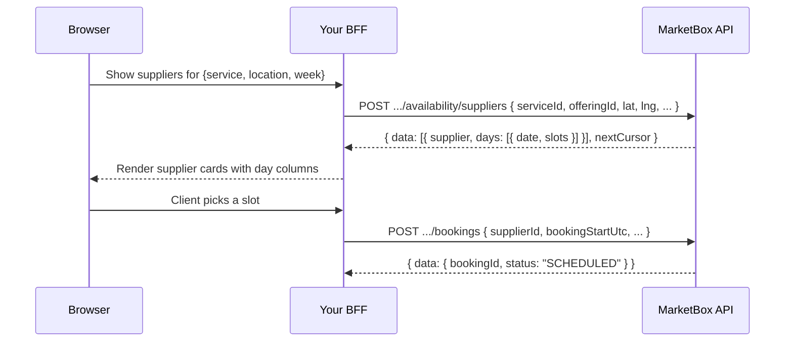

This guide covers `POST /v1/projects/{projectId}/availability/suppliers`: a
**supplier-centric** availability search. You give it a service, a location,
and a window; it returns a paginated list of suppliers, each with its full
profile and its open slots bucketed by local day. It's built for one job —
rendering a **wall of supplier cards** ("here are the people who can do this,
and when") — for a human UI or an AI agent assembling one.

It builds on [The booking engine model](/concepts/booking-engine-model) — read
that first if you haven't. It also assumes the
[BFF pattern](/guides/booking-flow-auth#the-bff-pattern) and an API key already
set up.

## Which availability endpoint

There are four availability endpoints plus the supplier list. They answer
different questions — pick by what you're rendering:

| Endpoint | Answers | Shape |
| --- | --- | --- |
| `POST .../availability/suppliers` | "Which **suppliers** can do this, and when?" | **Supplier-centric** — suppliers, each with open slots grouped by day. This guide. |
| `POST .../availability/search` | "What **slots** exist for this service here?" | Slot-centric — two flat arrays (`timeSlots`, `openSlots`), supplier as a field inside each slot. See [Availability and slates](/guides/availability-and-slates). |
| `POST .../availability/package-slate` | "Give me one supplier's **N-session plan** for a package." | A slate. See [Create a package booking](/guides/create-a-package-booking). |
| `POST .../availability/package-options` | "Which of this service's **packages** can I actually book, and how?" | Every ACTIVE package of the service, each with a ready-to-book slate. Use it when rendering a package storefront and you want one call instead of a fan-out. Always `200` — an unbookable package carries its own `status` + `reason`. |
| `GET .../suppliers` | "Who exists (regardless of availability)?" | The supplier catalogue, filterable by service/skill/region, or by a `lat`/`lng` point against live travel zones. See [Suppliers](/resources/suppliers). |

<Note>
`/availability/suppliers` and `/availability/search` run the **same open-slot
computation** over the same project data. The only difference is the shape of
the answer: `/suppliers` groups by supplier and inlines each supplier's full
profile, so a card wall needs exactly one call. `/search` hands you flat slot
arrays keyed by an opaque `supplierId` — fine when you want a single merged
list of times, but you'd have to group and then fetch each supplier to label a
card.
</Note>

## How it works

One request in, one page of suppliers out:



The endpoint returns **open slots only** — every regular-interval opening in
the window (`interval` controls the granularity). It does **not** return the
clustered, travel-optimized *suggestions* that `/search` and `/package-slate`
produce, and it has no recurring mode. That's deliberate: a wall wants "every
time you could book this person," not a ranked shortlist.

## The response, supplier-centric

```json
{
  "data": [
    {
      "supplier": {
        "supplierId": "sup_01kv60qgnef2kt3pvqgwmkbzfr",
        "firstName": "Priya",
        "lastName": "Nadeau",
        "avatarUrl": "https://example.com/suppliers/sup_01kv60qgnef2kt3pvqgwmkbzfr/256.webp",
        "bio": "Certified swim instructor, 8 years.",
        "city": "Toronto",
        "state": "ON",
        "maxTravelTime": 30,
        "services": [{ "serviceId": "srv_01kv60qg12e82acr78edfnjhvv", "name": { "en": "Private swim lesson" } }],
        "skills": [{ "skillId": "skl_01kv60qh0m2p", "name": { "en": "Infant aquatics" } }],
        "locations": [{ "locationId": "stz_01kv60qgs4e4nbjhzradnqtj0h", "locationType": "TRAVEL_ZONE", "name": "Downtown Toronto" }]
      },
      "days": [
        {
          "date": "2026-07-09",
          "slots": [
            {
              "slotId": "3f2504e0-4f89-41d3-9a0c-0305e82c3301",
              "startUtc": "2026-07-09T13:30:00.000Z",
              "startLocal": "2026-07-09T09:30:00-04:00",
              "endUtc": "2026-07-09T14:00:00.000Z",
              "endLocal": "2026-07-09T10:00:00-04:00"
            }
          ]
        },
        { "date": "2026-07-10", "slots": [] }
      ]
    },
    {
      "supplier": { "supplierId": "sup_01kv60qh9zt1q7", "firstName": "Sam", "lastName": "Okafor", "avatarUrl": null },
      "days": []
    }
  ],
  "timezone": "America/Toronto",
  "nextCursor": "eyJvZmZzZXQiOjIwfQ==",
  "errors": []
}
```

| Field | Meaning |
| --- | --- |
| `data[]` | Suppliers on this page, in a stable order across pages. |
| `data[].supplier` | The **full enriched supplier** — the exact shape `GET /suppliers` returns (profile, `avatarUrl`, `services`, `skills`, `locations`, `servedRegions`). Enough to render a card with no follow-up call. |
| `data[].days[]` | Days that have open slots, ascending by `date`. Empty (`[]`) for a supplier who matches but has nothing open in the window — see the note below. |
| `data[].days[].date` | Local calendar date (`YYYY-MM-DD`) in the request `timezone`. Bucket key for a day column. |
| `data[].days[].slots[]` | Open slots on that day, ascending by `startUtc`. |
| `timezone` | The timezone used for day bucketing and every `*Local` field (the request `timezone`, or the project default). |
| `nextCursor` | Pass back as `cursor` for the next page. `null` on the last page. |
| `errors` | Non-fatal engine messages. Usually empty. |

Each slot carries both a UTC anchor and pre-formatted local strings:

| Field | Meaning |
| --- | --- |
| `slotId` | Opaque id for the slot. Handy as a React key; not a hold (see the warning below). |
| `startUtc` / `endUtc` | The slot as UTC instants. **Use these as the booking anchors.** `endUtc` is `startUtc` + the resolved service duration. |
| `startLocal` / `endLocal` | The same times rendered in the request `timezone` (ISO-8601 with offset). **For display** — don't re-parse them for the booking call, use the UTC pair. |

<Note>
**Busy suppliers are still returned, with `days: []`.** A supplier who serves
the service and location but has no opening in your window comes back in
`data` with an empty `days` array, not dropped. That's intentional: it keeps
each page deterministic (a page is exactly `limit` matching suppliers), and it
lets you render a "no times this week" card instead of silently hiding
someone. Filter them client-side if you only want bookable cards
(`data.filter(s => s.days.length > 0)`).
</Note>

## Build the wall

<Steps>
<Step title="Search suppliers by availability">
From your BFF, POST the service + offering, a location (either a stored
`locationId` **or** a `lat`/`lng` pair), and the window. Keep the API key
server-side.

```ts
// app/api/bff/supplier-availability/route.ts
import { NextResponse } from 'next/server';

export async function POST(request: Request) {
  const { cursor } = await request.json();

  const res = await fetch(
    `${process.env.MARKETBOX_API_URL}/v1/projects/${process.env.MARKETBOX_PROJECT_ID}/availability/suppliers`,
    {
      method: 'POST',
      headers: {
        'x-api-key': process.env.MARKETBOX_API_KEY!, // server-only
        'content-type': 'application/json',
      },
      body: JSON.stringify({
        serviceId: 'srv_01kv60qg12e82acr78edfnjhvv',
        offeringId: 'off_01kv60qge5eh59ap0gw0pqrrys',
        lat: 43.6532,
        lng: -79.3832,
        lookAheadStartDate: '2026-07-09T00:00:00-04:00',
        lookAheadDays: 7,
        timezone: 'America/Toronto',
        interval: 30, // open-slot granularity in minutes
        limit: 20,
        cursor, // omit / undefined for the first page
      }),
    },
  );

  const body = await res.json().catch(() => ({}));
  return NextResponse.json(body, { status: res.status });
}
```

<Warning>
**Provide a location exactly one way.** Send either `locationId` (a stored
Location) **or** both `lat` and `lng` (in-home / travel-zone discovery) —
sending neither is a `400`. `lat`/`lng` is the branch to use when the client
enters an address; `locationId` when they pick a fixed venue.
</Warning>
</Step>

<Step title="Render the cards">
The response is already card-shaped — map `data` straight to components, and
`supplier.days` straight to day columns. No grouping, no per-supplier fetch.

```tsx
function SupplierWall({ page }: { page: SupplierAvailabilityResponse }) {
  return (
    <div className="wall">
      {page.data.map(({ supplier, days }) => (
        <article key={supplier.supplierId} className="supplier-card">
          
          <h3>{supplier.firstName} {supplier.lastName}</h3>
          <p>{supplier.bio}</p>

          {days.length === 0 ? (
            <p className="muted">No times this week</p>
          ) : (
            days.map((day) => (
              <div key={day.date} className="day-column">
                <h4>{day.date}</h4>
                {day.slots.map((slot) => (
                  <button
                    key={slot.slotId}
                    onClick={() => pickSlot(supplier.supplierId, slot)}
                  >
                    {slot.startLocal.slice(11, 16)} {/* "09:30" */}
                  </button>
                ))}
              </div>
            ))
          )}
        </article>
      ))}
    </div>
  );
}
```

Show `startLocal`/`endLocal` to the user; keep `startUtc`/`endUtc` for the
booking call in the next step.
</Step>

<Step title="Page through more suppliers">
Each supplier's availability is computed on demand, so pages are small by
design (`limit` max **50**, default 20). When `nextCursor` isn't `null`, pass
it back as `cursor` to fetch the next page; stop when it's `null`.

```ts
let cursor: string | undefined = undefined;
const suppliers = [];
do {
  const page = await fetchSupplierAvailability({ cursor }); // the BFF route above
  suppliers.push(...page.data);
  cursor = page.nextCursor ?? undefined;
} while (cursor);
```

<Tip>
`cursor` is opaque — a base64 token, not a supplier offset you should build
yourself. Only ever pass back a `nextCursor` you were given, and only against
the **same** filter set (same service, location, and window) that produced it.
Changing the filters mid-pagination gives undefined results.
</Tip>
</Step>

<Step title="Book the chosen slot">
A slot is availability, not a reservation. When the client picks one, book it
immediately with [Create a single booking](/guides/create-a-single-booking) —
the slot gives you everything the booking's timing needs:

```ts
// supplierId from the card; slot from the day column; timezone from the page.
await fetch(`${MARKETBOX_API_URL}/v1/projects/${MARKETBOX_PROJECT_ID}/bookings`, {
  method: 'POST',
  headers: { 'x-api-key': MARKETBOX_API_KEY, 'content-type': 'application/json' },
  body: JSON.stringify({
    clientId,
    supplierId,                       // data[].supplier.supplierId
    bookingStartUtc: slot.startUtc,   // the UTC anchors, not the *Local strings
    bookingEndUtc: slot.endUtc,
    bookingTz: page.timezone,
    // Location: reuse the SAME location you searched with —
    // locationId for a stored venue, or lat/lng + a structured address for TRAVEL_ZONE.
    locationType: 'TRAVEL_ZONE',
    latitude: 43.6532,
    longitude: -79.3832,
    locationId: 'stz_01kv60qgs4e4nbjhzradnqtj0h', // the supplier's travel-zone id
    address: { /* … see Create a single booking */ },
    capacity: 1,
    services: [{
      serviceId: 'srv_01kv60qg12e82acr78edfnjhvv',
      offeringId: 'off_01kv60qge5eh59ap0gw0pqrrys',
      businessModelType: 'SINGLE_BOOKING',
      quantity: 1,
      orderId,        // from a prior POST /orders — see the booking guide
      orderItemId,
    }],
  }),
});
```

<Warning>
**A search result is not a reservation.** These are open slots — another
client can take the same time until you actually claim it, and you'll get a
`409 SLOT_BOOKED` if they beat you to it.

If you need to reserve the time while the client pays, hold it:
`POST /holds` with an `intervals` array works for a **single session**, with
no package or slate involved, and you then convert the hold into the booking.
Each interval carries the same location contract as a booking —
`{ supplierId, startUtc, endUtc, bookingTz, locationType, … }`, where
`locationType` decides whether `locationId`, `latitude`, `longitude` and
`address` come with it. See
[Hold slots during checkout](/guides/hold-slots-for-checkout).
</Warning>
</Step>
</Steps>

## Rank suppliers by fit: `availabilityMatch`

Four optional **scoring criteria** shape a per-supplier fit score:
`lookAheadStartDate` — a field you may already be sending — plus three new
ones: `preferredTimes`, `daysOfWeek`, `sessionsPerWeek`. Send any of the four
and every supplier in the response grows an `availabilityMatch` object next
to `supplier` and `days`:

```json
{
  "supplier": { /* full supplier profile — same shape as above */ },
  "days": [ /* open slots, same shape as above */ ],
  "availabilityMatch": {
    "score": 0.8035714285714286,
    "components": {
      "startDate": 0.7142857142857143,
      "timeOfDay": 0.5,
      "daysOfWeek": 1,
      "sessionsPerWeek": 1
    }
  }
}
```

<Note>
**`availabilityMatch` is omitted, not `null`, when you send none of the four
scoring criteria above.** A bare request — just `serviceId`, `offeringId`,
and a location — gets a byte-identical response to before this field
existed. Don't assume the key exists; check for it before reading `.score`.
</Note>

- **`score`** is the plain mean of the components you triggered, 0–1,
  **renormalised over only the criteria you supplied** — not divided by 4.
  Send one preference and a supplier can score a clean `1.0`; that's correct,
  not a bug. Without renormalising, sending a single preference would cap
  every supplier at 0.25.
- **`components`** contains exactly the keys for the fields you sent — a key
  only appears when its matching request field was present.
- **No rounding.** Expect long floats like `0.8035714285714286`, not `0.8`.
- Each component is a **coverage ratio, not a slot count**. A supplier with
  200 open slots isn't a better fit than one with 40 if both cover the
  pattern you asked for equally well — counting slots would just rank the
  busiest calendar top, which is the opposite of what a fit score is for.

### The four components

| Component | Present when you send | Meaning |
| --- | --- | --- |
| `startDate` | `lookAheadStartDate` | How soon the supplier's first open slot arrives after the window opens: `1 - (daysUntilFirstSlot / windowDays)`, where `windowDays` is the number of local dates your search window actually spans (not `lookAheadDays` — see below). `1` = free on day one, `0` = no slots in the window. |
| `timeOfDay` | `preferredTimes` | Of the days this supplier has any availability, the fraction with at least one slot **starting** inside a `preferredTimes` window. |
| `daysOfWeek` | `daysOfWeek` | Of the weekdays you asked for, the fraction the supplier can cover somewhere in the window. |
| `sessionsPerWeek` | `sessionsPerWeek` | Of the whole weeks in the window, the fraction with at least `sessionsPerWeek` distinct days carrying a slot. |

<Warning>
**`startDate`'s denominator is the local dates your window actually spans —
not `lookAheadDays`.** A window that doesn't open at local midnight reaches
one calendar date further than `lookAheadDays` suggests, and the default path
doesn't open at midnight: an omitted `lookAheadStartDate` resolves to *now*,
and any minimum-booking-notice policy can shift it later still. Concretely, a
window opening Tuesday 14:00 with `lookAheadDays: 7` runs through the
following Tuesday 14:00 — that's **eight** local dates, not seven. The two
only coincide when the window happens to end at exact local midnight.
</Warning>

`startDate` itself only appears when you explicitly send
`lookAheadStartDate` — even though the field always has an effective value
(it defaults to now), sending nothing means no criterion was expressed, so
nothing is scored or averaged in. This is what lets a request with none of
the four scoring criteria come back with no `availabilityMatch` at all.

Two more behaviours worth knowing:

- **`sessionsPerWeek` counts consecutive 7-day blocks from the start of your
  window**, not ISO/Monday weeks, and a **trailing partial week isn't
  scored** — a 10-day window has exactly one scored week; slots in the
  leftover 3 days still count toward the other three components. A window
  shorter than 7 days is evaluated as a single week at the full,
  un-prorated threshold.
- **`daysOfWeek`'s denominator is the weekdays you requested**, so a window
  shorter than a week caps the component below `1` — asking for `[1, 3, 5]`
  over a 4-day window can reach at most `2/3`. Widen the window if you need
  the component to be reachable.

**`preferredTimes` windows may cross midnight.** `{ "startTime": "22:00",
"endTime": "02:00" }` matches a slot starting at `23:00` *and* one starting at
`01:00` — when `startTime > endTime` the window is read as spanning
midnight. Membership is inclusive at both ends.

<Warning>
**`daysOfWeek` ranks here; it's a hard filter on `/availability/package-slate`.**
Same field name, opposite behaviour. On this endpoint, a weekday you leave
out of `daysOfWeek` is never removed from a supplier's `days[]` — it only
lowers that supplier's `daysOfWeek` component and therefore their `score`.
Compare [`daysOfWeek` is a hard filter, not a preference](/guides/availability-and-slates#daysofweek-is-a-hard-filter-not-a-preference)
on `package-slate`, where the same field name removes days from the plan
before it's built.
</Warning>

**`excludeDates` removes slots; it doesn't lower a score.** A blacked-out
date never appears in `days[]` for any supplier, and `excludeDates` has no
component in `availabilityMatch`. The filter runs against the slot pool
*before* the four components are computed, so a blackout influences a score
exactly as much as it shows up in the response — not at all.

<Note>
**Suppliers with no matching availability still get an entry — with `score:
0`, not dropped.** Every supplier on the page is scored, in page order. Page
size and `nextCursor` behave exactly as they do without `availabilityMatch`.
</Note>

<Warning>
**Ranking only holds within a single page.** `availabilityMatch.score` is
comparable between suppliers *in the same response* — it is **not** a
globally ranked list across pages. Page membership is decided by supplier id
(sorted, then sliced) before any availability or score is computed, so a
supplier on page 2 can legitimately outscore every supplier on page 1. This
is deliberate: it bounds the cost of the endpoint, since each supplier's
availability is computed on demand. Don't paginate expecting suppliers to
arrive in descending score order — sort/filter within a page instead, or pull
every page before ranking across the whole set.
</Warning>

### Worked example

A request supplying all four scoring criteria, plus `excludeDates`:

```json
{
  "serviceId": "srv_01kv60qg12e82acr78edfnjhvv",
  "offeringId": "off_01kv60qge5eh59ap0gw0pqrrys",
  "lat": 43.6532,
  "lng": -79.3832,
  "lookAheadStartDate": "2026-07-07T00:00:00-04:00",
  "lookAheadDays": 14,
  "timezone": "America/Toronto",
  "preferredTimes": [{ "startTime": "17:00", "endTime": "20:00" }],
  "daysOfWeek": [1, 3, 5],
  "sessionsPerWeek": 2,
  "excludeDates": ["2026-07-10"],
  "limit": 20
}
```

The matching response fragment for one supplier, with all four components
present:

```json
{
  "data": [
    {
      "supplier": {
        "supplierId": "sup_01kv60qgnef2kt3pvqgwmkbzfr",
        "firstName": "Priya",
        "lastName": "Nadeau"
      },
      "days": [
        { "date": "2026-07-09", "slots": [ /* one slot starting inside 17:00–20:00 */ ] },
        { "date": "2026-07-13", "slots": [ /* one slot starting inside 17:00–20:00 */ ] },
        { "date": "2026-07-15", "slots": [ /* slots present, all outside 17:00–20:00 */ ] }
      ],
      "availabilityMatch": {
        "score": 0.6726190476190476,
        "components": {
          "startDate": 0.8571428571428572,
          "timeOfDay": 0.6666666666666666,
          "daysOfWeek": 0.6666666666666666,
          "sessionsPerWeek": 0.5
        }
      }
    }
  ],
  "timezone": "America/Toronto",
  "nextCursor": null,
  "errors": []
}
```

The window is a clean 14 local dates (midnight-aligned, so `windowDays`
equals `lookAheadDays` here — see the warning above for when it doesn't).
`startDate` is `1 - 2/14`: the supplier's first slot, on `2026-07-09`, lands
two days in. `timeOfDay` is `2/3`: of the three days with any availability
(`07-09`, `07-13`, `07-15`), two carry a slot that *starts* inside the
`17:00`–`20:00` window — `07-15`'s slots all start outside it. `daysOfWeek`
is also `2/3`: of the requested `[1, 3, 5]` (Mon/Wed/Fri), the supplier
covers Monday (`07-13`) and Wednesday (`07-15`) but not Friday — it simply
has no slots on `2026-07-17`, the window's other Friday. (`2026-07-10`, the
Friday you excluded, never had a slot to remove — `excludeDates` isn't why
Friday scores zero here.) `sessionsPerWeek` is `1/2`: the window's two whole
7-day blocks are `07-07`–`07-13` and `07-14`–`07-20`; the first holds two
distinct days with a slot (`07-09` and `07-13`), meeting the requested
threshold of 2, and the second holds only one (`07-15`), missing it.
`2026-07-10` itself is simply **absent** from `days[]` — excluded dates never
appear there, empty or otherwise. `score` is the exact mean of the four:
`(0.8571428571428572 + 0.6666666666666666 + 0.6666666666666666 + 0.5) / 4`.

## Notes on the window and timezone

<Note>
**`timezone` decides the day buckets.** Days are bucketed by local calendar
date in the request `timezone` (or the project default if you omit it) — so
the same UTC instant can land on different `date`s for clients in different
zones. The `*Local` fields are rendered in that same zone. If your UI shows
day columns, always send the viewer's `timezone`.
</Note>

<Note>
**No matching suppliers is a `200`, not an error.** If no supplier serves the
service at that location, you get `{ "data": [], "nextCursor": null }`. Widen
the location or the window, or check who covers the point with
[`GET /suppliers?lat=…&lng=…`](/resources/suppliers#listing-suppliers) — it
needs no service or offering, so it separates "nobody serves here" from
"nobody is free this week".
</Note>

## Reference

### Endpoints used in this guide

| Endpoint | Method | Auth | Description |
| --- | --- | --- | --- |
| `/v1/projects/{projectId}/availability/suppliers` | `POST` | `x-api-key` | Supplier-centric availability. Returns a page of suppliers, each with open slots grouped by day. `limit` max 50, opaque `cursor`. |
| `/v1/projects/{projectId}/bookings` | `POST` | `x-api-key` | Book a chosen slot. Uses the slot's `startUtc`/`endUtc` and the supplier's id. See [Create a single booking](/guides/create-a-single-booking). |
| `/v1/projects/{projectId}/availability/search` | `POST` | `x-api-key` | Slot-centric alternative — same computation, flat arrays. Full reference: [Availability](/resources/availability). |
| `/v1/projects/{projectId}/suppliers` | `GET` | `x-api-key` | The supplier catalogue (availability-independent), filterable by service/skill/region or by `lat`/`lng` point. |

### Request fields

| Field | Required | Notes |
| --- | --- | --- |
| `serviceId`, `offeringId` | Yes | The service and its offering (variant) to find availability for. |
| `locationId` **or** `lat` + `lng` | Yes (one way) | Stored Location id, **or** a coordinate pair for travel-zone discovery. Neither → `400`. |
| `lookAheadStartDate` | No | ISO-8601 start of the window. Defaults to now. |
| `lookAheadDays` | No | Days forward to search. Defaults to the engine's window. |
| `timezone` | No | IANA zone for day bucketing + `*Local` fields. Defaults to the project timezone. |
| `interval` | No | Open-slot granularity in minutes (e.g. `30`). Defaults to 15. |
| `durationMinutes` | No | Override the booked duration — **FLEXIBLE offerings only**; otherwise the offering's own duration is used. |
| `distanceUnit` | No | `km` or `mi` for travel calculations. |
| `limit` | No | Suppliers per page, 1–50 (default 20). |
| `cursor` | No | Opaque token from a prior `nextCursor`. Omit for the first page. |
| `preferredTimes` | No | `[{ startTime: "HH:mm", endTime: "HH:mm" }]`. Time-of-day windows you'd prefer sessions to land in. Ranking only — no slot is removed for falling outside them. A window may cross midnight; see [Rank suppliers by fit](#rank-suppliers-by-fit-availabilitymatch) above. |
| `daysOfWeek` | No | Weekdays you'd prefer (`0 = Sunday … 6 = Saturday`), 1–7 entries. **Ranking only on this endpoint** — omit for "any day". See [Rank suppliers by fit](#rank-suppliers-by-fit-availabilitymatch) above; the same field name is a hard filter on `/availability/package-slate`. |
| `excludeDates` | No | Local `YYYY-MM-DD` dates that must not carry a session, max 90, each passed individually (no range form). Matched against each slot's own local calendar date. **Removes slots** — see [Rank suppliers by fit](#rank-suppliers-by-fit-availabilitymatch) above. |
| `sessionsPerWeek` | No | Integer 1–14: how many sessions per week you'd want to be able to book with this supplier. A plain weekly-cadence preference that feeds the score — there's no package and no `COUNT` to plan against here, unlike `/availability/package-slate`. |

### Configuration

| Value | Env var | Browser? |
| --- | --- | --- |
| API key | `MARKETBOX_API_KEY` | **No** (server-only) |
| API base URL | `MARKETBOX_API_URL` | **No** (BFF-only) |
| Project id | `MARKETBOX_PROJECT_ID` | **No** (BFF-only) |

### Errors and edge cases

| Scenario | `code` | Status | Resolution |
| --- | --- | --- | --- |
| Neither `locationId` nor both `lat`+`lng` provided | `VALIDATION_ERROR` | `400` | Send one location form: a `locationId`, or both `lat` and `lng`. |
| `limit` out of range (`< 1` or `> 50`) | `VALIDATION_ERROR` | `400` | Use 1–50. Pages are small because each supplier is computed on demand. |
| Malformed `cursor` | `BAD_REQUEST` | `400` | Only pass back a `nextCursor` you were given; don't hand-build the token. |
| `serviceId`/`offeringId` doesn't resolve to an offering | `INTERNAL_ERROR` | `500` | Make sure both ids are correct and from this project — an unknown offering can't be searched. |
| No supplier serves the service at that location | — | `200` | Not an error: `data` is `[]`. Widen the location/window, or verify coverage via `GET /suppliers?lat=&lng=` with the same point. |
| Supplier matches but is fully booked in the window | — | `200` | Not an error: that supplier is returned with `days: []`. Filter client-side if you only want bookable cards. |
| API key can't access this project | — | `403` | Use a key scoped to `{projectId}`. See [Projects and scope](/concepts/projects-and-scope). |

See [Errors](/concepts/errors) for the full envelope and code list, and
[Pagination](/concepts/pagination) for how the opaque `cursor` works across
every list endpoint.

<CardGroup cols={2}>
<Card title="Create a single booking" icon="calendar-check" href="/guides/create-a-single-booking">
Turn a chosen slot into a confirmed booking — order, order item, then booking.
</Card>
<Card title="Availability and slates" icon="layer-group" href="/guides/availability-and-slates">
The slot-centric `/search` endpoint, plus packages, holds, and the clustering engine in depth.
</Card>
<Card title="Suppliers" icon="users" href="/resources/suppliers">
The full supplier profile shape returned in each card — services, skills, and locations.
</Card>
<Card title="The booking engine model" icon="diagram-project" href="/concepts/booking-engine-model">
Orders, order items, bookings, and how availability feeds them.
</Card>
</CardGroup>
