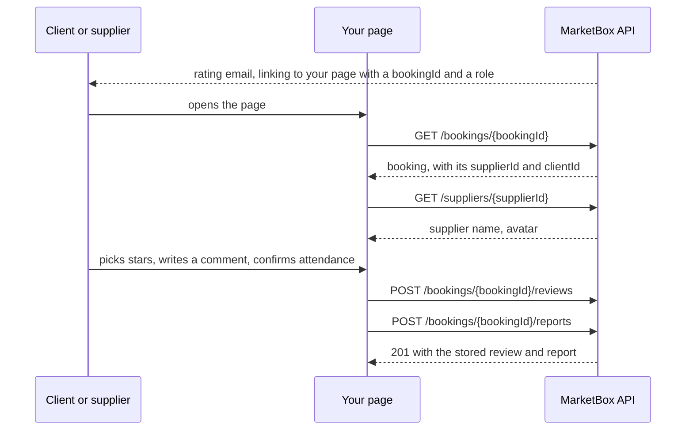

MarketBox records two kinds of feedback about a booking:

- a **review** — a 1–5 star rating with optional text, written in either direction: a client
  rating the supplier who served them, or a supplier rating the client.
- a **report** — one side stating a fact about the booking. Today the only fact is attendance:
  "I showed up".

Both hang off a booking, so this page builds on [Bookings](/resources/bookings). If you are
building your own page for clients and suppliers to leave feedback, everything you need is here.

## Direction is the thing to get right

A review always names both parties, and **which one is being rated depends on the direction**:

| `direction`          | `supplierId` is…          | `clientId` is…            |
| -------------------- | ------------------------- | ------------------------- |
| `CLIENT_TO_SUPPLIER` | the subject — being rated | the author                |
| `SUPPLIER_TO_CLIENT` | the author                | the subject — being rated |

Rather than apply that table yourself, read the two derived fields every review response carries:

- `subjectType` — `SUPPLIER` or `CLIENT`
- `subjectId` — the id of whoever is being rated

A rating only ever moves the **subject's** average. Reviews written before two-way reviews
existed carry no `direction` and are reported as `CLIENT_TO_SUPPLIER`.

## How it works



Your page calls MarketBox from **your server**, never the browser: the API key is a server-only
secret. See [Authentication](/concepts/authentication).

### What MarketBox puts in the link

Set `reviewRedirectUrl` in your project's notification settings and MarketBox sends recipients
there instead of to its own page. It appends its own query parameters to whatever URL you
configure, merging them into any query string already present:

| Parameter   | Always sent? | Values                  | What it means                                     |
| ----------- | ------------ | ----------------------- | ------------------------------------------------- |
| `bookingId` | yes          | a booking id            | which booking the feedback is about                |
| `role`      | yes          | `client` \| `supplier`  | **which side clicked** — see below                 |
| `rating`    | star links only | `1`–`5`              | the star they tapped, to pre-select in your form   |

**Treat these leniently.** Ignore parameters you do not recognise, and expect new ones to appear
over time; `role` itself was added after `bookingId`. Nothing that was already sent has changed
meaning.

If your URL contains the literal token `{bookingId}`, MarketBox substitutes it **and still appends
the `bookingId` parameter**. You get the id twice on purpose — parse whichever you prefer.

```
configured:  https://acme.example/review/{bookingId}
sent:        https://acme.example/review/bk_123?bookingId=bk_123&role=client

configured:  https://acme.example/feedback?src=mb
sent:        https://acme.example/feedback?src=mb&bookingId=bk_123&role=supplier&rating=4
```

#### `role` tells you who is standing in front of you

One booking produces two different asks, and both land on the same URL:

| `role`     | Who clicked | What to show                                                                 |
| ---------- | ----------- | ---------------------------------------------------------------------------- |
| `client`   | the client  | rate the **supplier** — post `direction: "CLIENT_TO_SUPPLIER"`                 |
| `supplier` | the supplier | rate the **client**, and confirm attendance — post `direction: "SUPPLIER_TO_CLIENT"` |

Without it your page cannot tell the two apart from the booking id alone, and would show one side
the other side's form. If `role` is missing or unrecognised — an old link, a hand-edited URL —
fall back to your own signed-in context rather than guessing; do not default to `client`.

`role` says which side was **emailed**, not which side is authenticated. It is a routing hint in a
URL anyone can edit, so keep authorising the submission the way you already do.

## Leaving a review

<Steps>
  <Step title="Resolve the booking">
    Your page is given a `bookingId`. `GET /v1/projects/{projectId}/bookings/{bookingId}` returns
    the booking, including `clientId`, `supplierId` and the local date and time. You never send
    those ids back — MarketBox reads them off the booking itself.
  </Step>
  <Step title="Collect a rating">
    A whole number from 1 to 5, plus optional text up to 5000 characters.
  </Step>
  <Step title="Post it">
    ```bash Leave a review
    curl -X POST "$MARKETBOX_API_URL/v1/projects/$MARKETBOX_PROJECT_ID/bookings/bk_01kv60qge5eh59ap0gw0pqrrys/reviews" \
      -H "x-api-key: $MARKETBOX_API_KEY" \
      -H "Content-Type: application/json" \
      -d '{
        "direction": "CLIENT_TO_SUPPLIER",
        "ratingStars": 5,
        "reviewText": "Turned up on time and did a great job."
      }'
    ```

    ```json 201 Created
    {
      "data": {
        "reviewId": "rev_01kv60qge5eh59ap0gw0pqrrys",
        "direction": "CLIENT_TO_SUPPLIER",
        "subjectType": "SUPPLIER",
        "subjectId": "sup_01kv60qgnef2kt3pvqgwmkbzfr",
        "supplierId": "sup_01kv60qgnef2kt3pvqgwmkbzfr",
        "clientId": "cli_01kx16ek2jf4r9da74adf6m4h0",
        "bookingId": "bk_01kv60qge5eh59ap0gw0pqrrys",
        "ratingStars": 5,
        "reviewText": "Turned up on time and did a great job.",
        "supplierName": "Dana Whitfield",
        "createdAt": "2026-08-12T14:05:00.000Z"
      }
    }
    ```
  </Step>
  <Step title="Show what is already there">
    `GET /v1/projects/{projectId}/bookings/{bookingId}/reviews` returns every review linked to
    the booking, newest first, so a returning visitor sees their own rating rather than an empty
    form.
  </Step>
</Steps>

Responses carry `supplierName` and `clientName` alongside the ids, so a page can render a name
without a second call. They are best-effort: a counterparty whose profile cannot be resolved keeps
its bare id and the name fields are simply absent. No email address is returned for either party.

Those names only exist once a review does, which is backwards for a page whose job is collecting
the first one. Before any review exists, get both display names from
`GET /v1/projects/{projectId}/bookings/{bookingId}/aggregate` in a single call — its `parties`
object carries `parties.client.fullName` and `parties.supplier.fullName`, which is the only way to
turn a `clientId` into a name (there is no public client read endpoint).

### One review per booking per direction

The two sides are independent — a booking can hold one client-to-supplier review and one
supplier-to-client review — but a second review in the **same** direction returns **409**
`REVIEW_ALREADY_EXISTS`. Uniqueness is enforced inside the same write as the review, so two
simultaneous submissions cannot both win.

Treat a review as permanent. There is no update or delete route, and the rating it contributes to
the subject's average is not reversible.

### Two ways to create a review

| | `POST /bookings/{bookingId}/reviews` | `POST /reviews` |
| --- | --- | --- |
| Booking | required, and validated | optional, and not validated |
| Party ids | read off the booking | taken from your request body |
| Duplicates | rejected, one per direction | never rejected |
| Direction | either | client-to-supplier only |

**Use the booking-scoped route.** The project-level `POST /v1/projects/{projectId}/reviews`
predates it and is deliberately permissive; it remains for existing integrations.

### Reviews and the rating emails

After a booking ends MarketBox emails **both sides** asking for a rating, and follows up if none
arrives. The client is asked to rate the supplier; the supplier is asked to rate the client and
confirm they attended. The two arrive on the same cadence and are told apart by `role` in the link.

**A review linked to a booking stops the follow-ups for that side.** The booking-scoped route
links it for you. A review posted through the project-level route without a `bookingId` does not,
and the recipient keeps being asked to rate something they have already rated.

**The two directions suppress independently.** A `CLIENT_TO_SUPPLIER` review stops the client's
follow-ups only; the supplier keeps being asked until a `SUPPLIER_TO_CLIENT` review exists, and
vice versa. That is deliberate — one side answering says nothing about the other — so do not
expect writing one review to silence both.

Suppression keys on the **review**, not the attendance report. A supplier who confirms attendance
but leaves no rating will still be asked again.

## Reporting on a booking

A report is a **self-report**. A `CLIENT` report says the client attended; a `SUPPLIER` report
says the supplier attended. Neither says anything about the other party, so a supplier cannot mark
a client as absent through this endpoint.

```bash File a report
curl -X POST "$MARKETBOX_API_URL/v1/projects/$MARKETBOX_PROJECT_ID/bookings/bk_01kv60qge5eh59ap0gw0pqrrys/reports" \
  -H "x-api-key: $MARKETBOX_API_KEY" \
  -H "Content-Type: application/json" \
  -d '{ "reporterRole": "CLIENT", "attended": true }'
```

`reportType` defaults to `ATTENDANCE`, the only type today. `reporterId` is read off the booking
and is not accepted in the body.

Because this gets clicked from an email, **resubmitting is safe**:

| Situation | Response |
| --- | --- |
| Nothing on file | **201** with the new report |
| Identical to what is on file | **200** with the stored report |
| Contradicts what is on file | **409** `REPORT_ALREADY_EXISTS` |

`note` is not part of what a report asserts — the claim is `reportType` plus `attended`. Resending
those unchanged with different text returns 200 with the record **as stored**, original note
included. A filed report cannot be edited.

`GET /v1/projects/{projectId}/bookings/{bookingId}/reports` returns both sides' reports.

## Averages

MarketBox maintains a running average as reviews are written, for suppliers and for clients:

```bash Supplier rating summary
curl "$MARKETBOX_API_URL/v1/projects/$MARKETBOX_PROJECT_ID/suppliers/sup_01kv60qgnef2kt3pvqgwmkbzfr/review-summary" \
  -H "x-api-key: $MARKETBOX_API_KEY"
```

```json 200 OK
{ "data": { "supplierId": "sup_01kv60qgnef2kt3pvqgwmkbzfr", "averageRating": 4.8, "reviewCount": 27 } }
```

A subject nobody has rated returns zeros rather than a 404. Use these instead of paging every
review to compute a star rating yourself.

## Reference

### Endpoints

| Method | Path | Purpose |
| --- | --- | --- |
| `POST` | `/v1/projects/{projectId}/bookings/{bookingId}/reviews` | Leave a review, either direction |
| `GET` | `/v1/projects/{projectId}/bookings/{bookingId}/reviews` | Every review on a booking |
| `POST` | `/v1/projects/{projectId}/bookings/{bookingId}/reports` | File one side's report |
| `GET` | `/v1/projects/{projectId}/bookings/{bookingId}/reports` | Both sides' reports |
| `GET` | `/v1/projects/{projectId}/clients/{clientId}/reviews` | Reviews written **about** a client |
| `GET` | `/v1/projects/{projectId}/clients/{clientId}/review-summary` | A client's average |
| `GET` | `/v1/projects/{projectId}/suppliers/{supplierId}/review-summary` | A supplier's average |
| `POST` | `/v1/projects/{projectId}/reviews` | Older, permissive create route |
| `GET` | `/v1/projects/{projectId}/reviews` | Project-wide client-to-supplier reviews |

### Review fields

| Field | Notes |
| --- | --- |
| `reviewId` | `rev_…`, stable. |
| `direction` | `CLIENT_TO_SUPPLIER` or `SUPPLIER_TO_CLIENT`. |
| `subjectType`, `subjectId` | Derived — who is being rated. |
| `supplierId`, `clientId` | Both parties; which is the subject depends on `direction`. |
| `ratingStars` | Whole number, 1–5. |
| `reviewText` | Optional, ≤ 5000 characters. |
| `bookingId` | The booking this is about. |
| `supplierName`, `clientName` | Best-effort display names. No email address is returned. |
| `createdAt` | ISO 8601 UTC. |

### Report fields

| Field | Notes |
| --- | --- |
| `reporterRole` | `CLIENT` or `SUPPLIER` — identifies the report, with the booking. |
| `reporterId` | That party's id, read off the booking. |
| `reportType` | `ATTENDANCE` today; defaults on create. |
| `attended` | Whether the **reporting** side attended. |
| `note` | Optional, ≤ 1000 characters, not part of the claim. |

### Errors

| Code | Status | Meaning |
| --- | --- | --- |
| `NOT_FOUND` | 404 | No such booking in this project. |
| `UNPROCESSABLE_ENTITY` | 422 | The booking is cancelled, or has no supplier assigned. |
| `REVIEW_ALREADY_EXISTS` | 409 | This side has already reviewed this booking. |
| `REPORT_ALREADY_EXISTS` | 409 | This side has already filed a different report. |
| `VALIDATION_ERROR` | 400 | The body failed validation. |

<Check>
- Call MarketBox from your server — the API key must never reach a browser.
- Send `direction`, stars and text only. Party ids come off the booking.
- Read `subjectId` rather than deciding for yourself which party a rating is about.
- Link reviews to the booking so MarketBox stops asking the client to rate it.
- Handle 409 as "already answered", not as a failure — show what is on file.
</Check>
